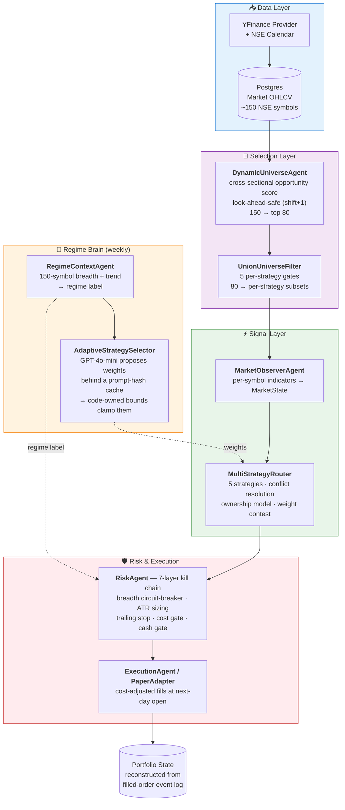
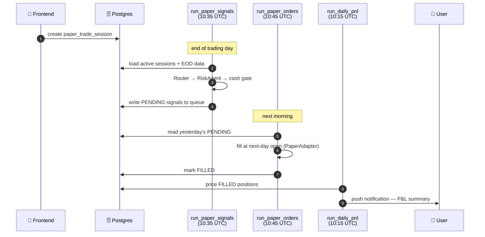
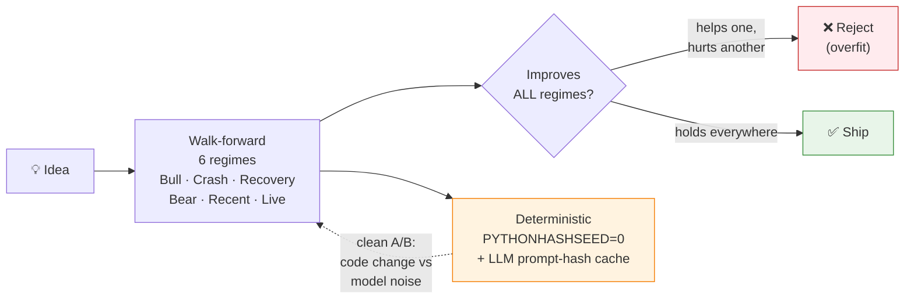

# Financial Lab — Systematic Trading & Strategy Research Platform

> A production systematic-trading system for **NSE (Indian) equities**: a five-strategy
> momentum / mean-reversion ensemble with an **LLM-assisted regime brain**, a
> **walk-forward backtesting engine** validated across six market regimes, a deterministic
> risk layer, and a **live paper-trading loop**. Built solo, end-to-end — from the market
> math to the data pipeline to the API to the mobile app.

*All results are net of realistic costs (0.10% commission + 0.05% slippage per side).
Paper trading only — no live capital at risk.*

---

## What problem this solves

Discretionary trading doesn't scale and can't be tested. Financial Lab turns "what should I
buy today?" into a **reproducible pipeline**: rank a universe, generate signals from
multiple strategies, weight them by the current market regime, size positions by risk, and
execute — with every decision logged and every change validated against six historical
regimes *before* it ships. The guiding principle throughout is **correctness first**: if a
result can't be reproduced or could be contaminated by look-ahead, it doesn't count.

---

## System architecture

Each layer has **one responsibility** and a **typed hand-off** to the next. Crucially, the
same domain code (`app/`) runs in both the **backtest** and the **live** path — only the
data source and the execution adapter change. That's what makes the backtest trustworthy.



**The five strategies** (`app/strategy/`): DualMA (golden-cross trend), Breakout &
QuietBreakout (momentum), TrendPullback (buy-the-dip in an uptrend), RSI Mean-Reversion
(oversold-in-uptrend). Each implements a uniform `decide()` interface, so the ensemble is
pluggable and every strategy is testable in isolation.

---

## The two data stores (two concerns)

| Store | Holds | Why |
|---|---|---|
| **PostgreSQL** (managed) | Market OHLCV, signals, paper-trade sessions, positions, push tokens | Shared source of truth — read by the API, cron jobs, and the mobile/web frontend; connection-pooled for the hot path |
| **SQLite** (`api_state.db`) | Strategy configs, backtest run records, LLM weight decisions | Local operational state for the API layer — simple, no HA needed |

Portfolio state is **event-sourced**: there is no authoritative positions table — it's
reconstructed on demand from `FILLED` order rows. Append-only, auditable, no dual-write
consistency bugs.

---

## Live trading lifecycle

The paper-trading loop runs as scheduled cron jobs against the shared Postgres store,
walking the *same* pipeline the backtest uses.



---

## How research works (the part that matters most)

A trading idea is worthless until it survives validation. The backtest engine
(`app/backtest/engine.py`) is a **daily event loop** with three correctness guarantees:



1. **Walk-forward across six regimes** — a change must not help one market and quietly hurt
   another. The recurring failure mode ("improves the historical backtest, regresses the
   live-forward period") is exactly what this catches.
2. **Look-ahead prevention** — every feature uses completed bars only (`shift(1)`), and the
   engine replays day-by-day via `asof` lookups, so no code path can see the future in
   backtest *or* live.
3. **Reproducibility** — runs are deterministic; the only LLM call sits behind a SHA-256
   prompt-hash cache, so a code change can be A/B-tested without the model's randomness
   polluting the comparison.

---

## Where AI is used (and where it is deliberately *not*)

**"Model proposes, code disposes."** LLMs are used for *judgment under ambiguity*, never as
a system of record or a numerical ranker:

- **AdaptiveStrategySelector** — GPT-4o-mini re-weights the five strategies every five days
  from a regime snapshot. Its output is **clamped by code-owned per-regime bounds** and each
  strategy has a regime allowlist. The LLM never touches money directly — a bad response
  degrades to a bounded weight, never an unbounded trade.
- **Narrative service** — Claude generates plain-English explanations of signals and
  regime, with a template fallback if the key is absent.

---

## Tech stack

| Layer | Technology |
|---|---|
| API | **FastAPI** (async, Pydantic-typed contracts, shared Python domain code) |
| Data | **PostgreSQL** (SQLAlchemy 2.0) · SQLite (config) · YFinance (market data) |
| AI | **OpenAI GPT-4o-mini** (regime weights) · **Anthropic Claude** (narrative) |
| Execution | Paper adapter → Zerodha Kite adapter (path to live) |
| Clients | React web terminal · React Native mobile app |
| Ops | Scheduled cron jobs · push notifications (Expo) · email (Resend) |

---

## Design principles

- **Single-responsibility layers, typed hand-offs** — any one layer can be swapped or
  A/B-tested without the others moving.
- **Same code in backtest and live** — the paper results are trustworthy because there is no
  separate research codebase to drift out of sync.
- **Correctness over cleverness** — reproducibility, look-ahead prevention, and cost-adjusted
  fills come before any performance number.
- **Deterministic core, isolated AI** — the LLM is bounded, cached, and never on the money
  path unsupervised.

---

## Repository map

```
app/
├── universe/     # DynamicUniverseAgent + per-strategy filters (selection)
├── strategy/     # 5 strategies + MultiStrategyRouter (signals)
├── meta/         # AdaptiveStrategySelector + RegimeContextAgent (regime brain)
├── risk/         # RiskAgent — position sizing, circuit-breakers, stops
├── backtest/     # BacktestEngine — walk-forward daily event loop
├── execution/    # cost-adjusted fill simulation
├── data/         # MarketDataRepository, providers, NSE calendar
└── analytics/    # diagnostics: opportunity quality, ensemble, universe stability

api/               # FastAPI app (routers, services) + cron scripts (deployed)
docs/              # architecture reports, experiment logs, research write-ups
```

---

*Built to answer one question rigorously: **is the number on the screen actually right?***
