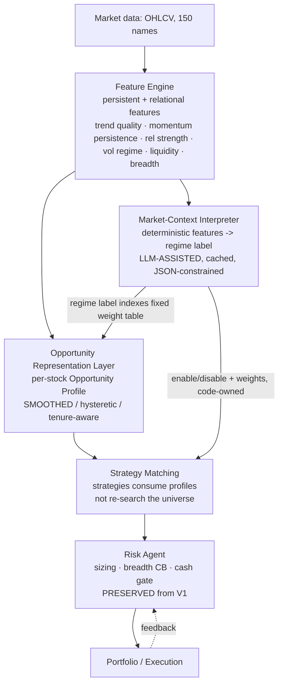

# Critical Architecture Review — Tactiq V1 vs. an Opportunity-First V2

*Role: senior quant researcher / systematic portfolio architect / applied-AI reviewer.
Mandate: disprove, don't validate. Every quantitative claim below is drawn from the
diagnostics in `docs/series/` (regenerate with
`finance/bin/python3 -m scripts.run_universe_analytics --fresh`).*

---

## Executive verdict

**You have not hit an architectural ceiling. You have a signal-frequency bug you have
never tested for.**

The diagnostics support your *facts* (the universe churns ~54%/day, half-life ~2 days,
consistently across all regimes) but not your *conclusion* (that this proves the design
is exhausted). The churn has a single, measurable, mechanical cause: the Opportunity
Score is computed entirely from **1-day, mean-reverting activity features** (relative
volume, single-day return, 5-day vol). The median *daily* change in a symbol's score is
**0.19** on a 0–1 scale, while the score gap that decides membership at the rank-80/81
boundary is **0.004**. Daily noise is roughly **50× larger than the margin that
controls membership**. Of course the universe reshuffles every day — you are ranking on
a coin flip and then asking why the coin won't stay heads.

Every downstream lever you optimized (exits, router, ownership, adaptive weights) sits
*below* this broken input. You were tuning the suspension on a car whose wheels are
falling off. The one lever that attacks the actual defect — the **temporal persistence
of the ranking signal** (smoothing, hysteresis, persistent factors) — is the one thing
your experiment log shows you never changed. You changed *what* to rank on (formulas,
quality scores). You never changed *how noisy the ranking is allowed to be over time*.

That lever is cheap, falsifiable, and untested. Until it is exhausted, the plateau
claim is unproven and the migration to a new architecture is premature.

---

## 1. Claim-by-claim evidence audit

Aggregated across all six periods (Bull 2019–20, Crash 2020, Recov 2020–21, Bear 2022,
Recent 2022–24, Live 2025–26). The striking feature is how *flat* everything is across
regimes.

| Your claim | Data | Verdict |
|---|---|---|
| Daily turnover ~54% | 52–58% (Live highest at 57.9%) | ✅ **Strongly supported** |
| Leader half-life ~2 days | 1.8–2.1 d | ✅ **Strongly supported** |
| Median tenure 1 day | 1.0 d in every period | ✅ **Strongly supported** |
| Instability is *algorithmic, not regime-specific* | Entropy 0.996 everywhere; eviction split 43/57 flat; deltas flat bull→crash→live | ✅ **Strongly supported** — the strongest conclusion you have |
| Boundary margin rank-80/81 very small | 0.0035–0.0042 | ✅ **Supported** (but you under-read its significance — see §2) |
| Opportunity-score volatility *low* | Median daily \|Δscore\| = **0.19**; \|Δrank\| = 32–37 (p90 ≈ 86–91) | ❌ **Refuted** — see below |
| Most rejections happen *inside strategy filters, not the top-N cutoff* | Top-N cutoff 20k vs ~700k filter rejections | 🟡 **Numerically true, inference invalid** — see §2 |
| Promotion persistence "reasonably good" | 57.7% "still top-80" at day+5 | 🟡 **Weak / cherry-picked metric** |
| We've reached the optimization ceiling of the architecture | No test of the ranking-persistence lever exists | ❌ **Unsupported** |

### Why "score volatility is low" is the critical error

This claim is doing a lot of load-bearing work in your argument, and it is wrong on the
honest metric.

- The **0.04** figure you're likely reading is the per-tenure standard deviation of the
  score. But **median tenure is 1 day**, so most "tenures" have exactly one observation
  and a std of 0 *by construction*. Averaging in thousands of structural zeros makes
  volatility look small. It's an artifact of the measurement window, not a property of
  the signal.
- The honest measure is the **day-over-day** score change for names in/around the
  universe: **median 0.19, p90 far higher**. On a 0–1 scale where the entire rank-75-to-85
  band spans only ~0.04, a *typical* daily score move of 0.19 blows a name clean across
  the boundary and back.
- Consequence: the median symbol moves **32–37 ranks per day** inside the 150-name
  ranking. That is not a stable ranking with a thin boundary. It is **noise wearing a
  ranking's clothes.**

The score volatility is not low. It is catastrophic *relative to the thing it controls*.
You reported "small margin" and "low volatility" as two separate curiosities. They are
the same phenomenon, and together they are the entire disease.

---

## 2. The real root cause (two coupled defects)

**Defect A — the ranking signal is sampled at the wrong frequency.**
`opportunity_score = 0.40·rank(relative_volume) + 0.30·rank(|daily_return|) +
0.30·rank(rolling_vol_5d)`. Two of the three inputs are effectively *today's* number.
Relative volume and single-day return are famously mean-reverting and near-random
day-to-day. You built a ranking whose inputs have almost no autocorrelation, so the
ranking itself has almost no persistence. 0.19 daily noise vs 0.004 margin is the direct
arithmetic of that choice.

**Defect B — the universe and the strategies optimize orthogonal axes.**
The universe ranks on **activity/agitation** (volume + move + vol). The strategies want
**structure** (trend, alignment, pullback, oversold-in-uptrend). A stock that spiked on
volume today has no reason to also be in a clean uptrend. This is *why* the filter pass
rates are so low:

| Filter | Pass rate |
|---|---|
| QuietBrk | 24.1% |
| Breakout | 16.7% |
| RSI-MR | 7.6% |
| TrendPB | 7.1% |
| DualMA | 4.6% |

Your inference — "rejections happen inside strategy filters, therefore the universe
isn't the bottleneck" — is a **non-sequitur**. The filters reject 76–95% of names
*because the universe hands them the wrong names.* The top-N cutoff rejects few (20k)
precisely because the real filtering has been outsourced downstream to strategies that
are correcting the universe's axis error one signal at a time. The universe *is* a
bottleneck; it's just failing silently by passing the buck rather than by rejecting at
the cutoff.

This also dismantles your "we keep reprocessing the same information" framing. The
problem is not that you lack information (MA/RSI/ATR/price/volume can carry a great deal
of structure). The problem is that (A) you sample the ranking layer at 1-day frequency
where those features are noise, and (B) you rank on a different axis than you trade on.
Both are **fixable inside V1** without a single new data source.

---

## 3. Answers to your ten questions

### Q1 — Are the conclusions supported?
- **Strongly supported:** churn magnitude (54% / 2-day / 1-day tenure) and its
  regime-invariance. This is real and important.
- **Weak:** "promotion persistence reasonably good" (you're citing a day+5 *snapshot* of
  57.7%; continuous tenure is 1 day — names oscillate out and back, which is worse for a
  holder than a clean drop, not better).
- **Refuted:** "opportunity-score volatility is low" (§1); "we've hit the architectural
  ceiling" (no test of the operative lever exists).
- **True but misused:** "rejections are inside filters not the cutoff" (§2).

### Q2 — Are you prematurely abandoning the architecture?
**Yes.** There is meaningful, high-EV research left in V1, and it targets the measured
root cause rather than the symptoms you already exhausted. Specifically untested:
1. **Temporal smoothing** of the ranking features (EMA/rolling median of rel-vol,
   return, vol) — directly collapses the 0.19 daily noise.
2. **Membership hysteresis** (enter at top-N, stay until top-1.5N) — decouples entry
   threshold from exit threshold so boundary names stop flickering.
3. **Position-aware universe** (never evict a name you currently hold; let the strategy's
   own exit close it) — makes universe churn irrelevant to open positions.
4. **Persistent factors** (multi-week momentum, relative strength vs index) added to or
   replacing the 1-day activity axis — aligns the ranking axis with the trading axis.

Note the distinction from your prior experiments: you changed the *formula content*
("richer score", "quality score", "persistence metric"). You never changed the *temporal
dynamics* (smoothing, hysteresis, tenure). Different lever entirely.

### Q3 — Have you reached an architectural plateau?
**Evidence insufficient to conclude yes.** A plateau claim requires showing that the
binding constraint has been relaxed and performance still didn't move. You relaxed
formula content and exit/router/weight mechanics. You never relaxed the churn dynamics
that the diagnostics identify as the binding constraint. You cannot call a ceiling you
haven't pushed against.

### Q4 — Is an Opportunity Representation Layer a reasonable next direction?
**Reasonable as a destination, wrong as the next step, and currently justified by the
wrong evidence.** The ORL is a genuinely good idea *for Defect B* (axis misalignment) —
giving every stock a structured profile (trend quality, momentum persistence, relative
strength, volatility compression, liquidity) and letting strategies *consume* profiles
is exactly how you align selection with trading. **But**: (a) it does nothing for Defect
A unless those profile features are themselves persistent/smoothed — you can rebuild the
same 1-day noise inside a fancier layer; (b) building it now means skipping the
cheap test that would tell you whether the churn is even the thing hurting returns. Do
the V1 stability experiments first; if they resolve the churn and returns still don't
move, *then* the ORL is justified by evidence rather than by fatigue.

### Q5 — In a redesign: preserve / kill / repurpose?
- **Preserve:** the single-responsibility pipeline and typed hand-offs (your best
  architectural asset per Episode 1); the RiskAgent and breadth circuit-breaker
  (empirically load-bearing — memory shows removing bounds crashes recovery); the
  observability/reason-code layer (it's how you found all of this); the deterministic
  core + LLM-behind-a-cache discipline.
- **Kill / demote:** the 1-day activity-only Opportunity Score as the *sole* ranking
  axis; the implicit assumption that universe membership must be recomputed from scratch
  daily with no memory.
- **Repurpose:** the strategy-specific universe filters. Today they're doing
  *remedial* work — correcting the universe's axis error. In V2 they become
  *profile-matchers*, not searchers (see Q6).

### Q6 — Should strategies continue to exist?
**Yes — but change their job.** Strategies remain the right abstraction for *risk
personality* and *exit discipline*. What should disappear is the model of a strategy as
an independent *searcher* re-scanning the universe. In V2 a strategy declares the
opportunity profile it wants ("high trend quality + momentum persistence + not
extended") and *matches* against pre-computed profiles. This kills the duplicated,
orthogonal-axis filtering and makes the 5-strategy ensemble actually diversify instead
of collapsing into a Breakout monopoly (your own Episode-2 finding).

### Q7 — What information is missing? What higher-order features?
Not "more data" — **more persistent and more relational** features:
- **Persistence / autocorrelation** of the current activity features (turn point-in-time
  noise into multi-day structure).
- **Relative strength** vs index and vs sector (you currently rank names in a vacuum).
- **Sector/breadth context** (is this name leading a strong group or a lone spike?).
- **Volatility-regime conditioning** (compression vs expansion) as a *state*, not a
  point value.
- **Liquidity quality** (spread/turnover stability) to downweight names that are only
  transiently "active."
- **Trend quality** (R² of the trend, not just MA alignment).
These are all derivable from the price/volume you already have. The gap is
*representation*, not acquisition.

### Q8 — Would an LLM meaningfully help, and where?
**Narrowly yes; broadly no.**
- **Where it does NOT help:** ranking stocks, generating signals, or replacing
  deterministic feature computation. An LLM is a bad, expensive, non-reproducible
  numerical ranker. Do not move it "into" the selection path.
- **Where it can help:** the *market-context / regime interpretation* node — turning a
  vector of breadth/vol/dispersion/leadership features into a **structured, discrete
  market-state label with rationale**, which then conditions (deterministically) how the
  profile features are weighted and which strategies are enabled.
  - **Inputs:** deterministic market-level features only (breadth, realized vol,
    dispersion, sector rotation, index trend) — never raw prices, never per-stock
    decisions.
  - **Outputs:** a constrained enum (regime label) + optional confidence, as JSON.
  - **Deterministic consumption:** the label indexes a *fixed, code-owned* table of
    profile weightings and strategy enablement — exactly your existing "model proposes,
    code disposes" pattern, kept behind the prompt-hash cache for reproducibility.
  This is your current adaptive layer, moved one step earlier and given richer context —
  an *evolution*, not a revolution.

### Q9 — What does V2 look like?

**Flow.** The Feature Engine computes *persistent, relational* features (fixing Defect A
by construction — smoothing/persistence is a property of the layer, not an afterthought).
The Market-Context Interpreter (the only LLM node, boxed on both sides) maps market-level
features to a regime label that deterministically conditions everything downstream. The
Opportunity Representation Layer assigns each stock a stable, multi-axis profile with
built-in **hysteresis and tenure** (fixing the churn). Strategies **match** profiles to
their philosophy rather than re-searching (fixing Defect B and the ensemble collapse).
Risk and portfolio are preserved verbatim.

**Why it's superior:** selection axis == trading axis; the ranking has designed-in
persistence so it can't churn 54%/day; the ensemble can actually diversify; the LLM adds
semantic context without touching invariants or reproducibility.

**Why it might not be worth it yet (honest risks):** it is strictly more machinery to
build, test, and keep deterministic; a richer feature layer invites **look-ahead/overfit**
bugs that a 3-feature score can't hide; and if Defect A is the whole story, a 20-line EMA
change in V1 captures most of the benefit at ~1% of the cost. Build V2 when V1's
stability lever is exhausted — not before.

### Q10 — Challenge every assumption
- **"We've tried everything on the universe."** No — you tried everything on the
  *formula*. The temporal-dynamics axis (smoothing/hysteresis/tenure) is untouched.
- **"Low score volatility means the universe is stable."** Refuted; 0.19 vs 0.004.
- **"Filters, not the universe, are the bottleneck."** The filters are *compensating*
  for the universe; low pass rates are a symptom of the universe, not exoneration of it.
- **"We're reprocessing the same information."** You're sampling good information at a
  frequency where it degrades to noise. Different problem, cheaper fix.
- **"The strategies are fine, the architecture is the ceiling."** The measured binding
  constraint (churn) has never been relaxed, so no ceiling has been demonstrated.
- **"An LLM earlier in the pipeline will add information."** Only if it emits a
  constrained, deterministic-consumed representation. As a ranker or signal-maker it adds
  cost and non-reproducibility, not edge.
- **Survivorship in the diagnostics themselves:** everything here is measured on the
  *selection* layer, decoupled from realized P&L. Before committing to any redesign,
  confirm the causal chain **churn → short holding → lost return** on trade-level data,
  not just that churn exists. It's highly plausible, but it is currently an inference.

---

## 4. Within-V1 experiment agenda (primary recommendation)

Ordered cheapest-first. Each is a `DynamicUniverseAgent`-level change, measured on
`docs/series/universe_daily_metrics.csv`, with the regime guardrail that killed prior
fixes (per project memory: bear/recovery legs regressed hard — **any stability lever must
still yield to the breadth circuit-breaker**).

| # | Change | Expected effect | Success metric | Guardrail |
|---|---|---|---|---|
| a | **EMA-smooth the 3 ranking features** (e.g. 3–5d) before scoring | Collapses 0.19 daily noise → ranking gains autocorrelation | Turnover ≪ 54%; median tenure > 1d | Re-run all 6 periods; no Recovery/Crash return regression |
| b | **Membership hysteresis** — enter top-80, retain to top-120 | Boundary names stop flickering | Half-life ↑; single-day tenures ↓ from ~100% | Same |
| c | **Position-aware universe** — never evict a held name | Universe churn no longer forces exits | Realized holding period ↑ | Held names still obey ATR stop + breadth CB |
| d | **Add a persistent axis** — multi-week momentum / relative strength | Aligns selection axis with trading axis | Filter pass rates ↑ from 5–24% | Watch for overfitting; walk-forward only |

**The falsifiable bar (this is the whole point):** implement (a) alone. If measured daily
turnover drops well below 54% and median tenure rises above 1 day **and returns still
don't improve across periods**, then — and only then — the plateau thesis earns real
support and the V2 migration is justified by evidence. If returns *do* improve, you've
recovered months of "failed" downstream experiments that were failing because of this
input, and V2 becomes optional rather than urgent.

---

## Bottom line

Your strongest conclusion (the instability is algorithmic and regime-invariant) is
correct and well-evidenced. Your load-bearing conclusion (low score volatility → we've
hit a ceiling → abandon the architecture) is refuted by your own data: the score is
noise-dominated, the churn has a mechanical and cheap fix, and the operative lever has
never been tested. **Spend two weeks disproving the ceiling before you spend two months
replacing the architecture.** The Opportunity Representation Layer is a good destination
built, right now, on the wrong evidence.

---

## 5. Experimental resolution (2026-07-22) — the churn→return chain is disproven

The review above set a falsifiable bar (§4): run the cheap stability levers; if they
reduce churn but returns don't improve, the plateau thesis earns support. We ran it.
All runs deterministic, no LLM: `PYTHONHASHSEED=0`,
`run_ujjwal_baseline.py --equal-weight-only`, env-gated in `app/universe/dynamic_agent.py`.

### 5.1 Defect A — EMA-smoothing the ranking features (`UNIVERSE_SMOOTH_SPAN`)

Stability moved exactly as predicted, monotonically with span, across all 6 periods:

| Metric | span 0 | span 5 |
|---|---|---|
| Turnover | 52–58% | 45–51% |
| Single-day tenures | 56–62% | 48–54% |
| Leader half-life | 1.8–2.1d | 2.0–2.4d |
| Score volatility | 0.037–0.041 | 0.028–0.031 |

**But EqW returns regressed on every period** (span 0 → span 5): Recov 49.6→43.5
(**−6.1pp**), Recent 21.8→20.6, Crash 19.6→18.5, Bull/Bear/Live flat-to-worse; fewer
trades, slightly worse DD/WR. The prediction that churn was noise "50× the margin" and
would collapse under smoothing **overshot**: the reduction is modest (~6pp) and returns
move the *wrong* way. The activity spike the universe ranks on is signal the strategies
(esp. Breakout) actually consume — smoothing it away deletes trades without upgrading them.

### 5.2 Defect B — realigning the ranking axis (`UNIVERSE_RANK_MODE`)

EqW Return % vs the `activity` (legacy) baseline:

| Period | activity | blend | momentum | twostage |
|---|---|---|---|---|
| Bull   | −2.1 | −3.4 | −4.4 | −3.1 |
| Crash  | 19.6 | 20.3 | 17.8 | 20.3 |
| Recov  | 49.6 | 49.7 | 44.4 | 49.0 |
| Bear   |  1.0 |  2.1 |  1.5 |  1.6 |
| Recent | 21.8 | 24.2 | 21.4 | 23.3 |
| Live   | −2.7 | −4.0 | −4.3 | −4.5 |

`momentum` is bad everywhere. `blend`/`twostage` improve the aggregate backtest middle
(Recent +1.5–2.4, Bear +0.6–1.1, Crash +0.7) — confirming the axis mismatch is **real** —
**but both regress Live −1.3 to −1.8pp.** "Helps historical backtests, hurts Live" is the
same overfit signature that killed every prior lever in this project. No axis is a clean win.

### 5.3 Verdict

Both root causes the review proposed were tested at the selection layer. Neither moves
returns; the two that touch anything trade Live for backtest-middle. The review flagged
*churn → short-holding → lost-return* as an **inference** — it is now **disproven**. The
selection/universe layer is **not the return bottleneck.**

Consequences:
- **V1 is not discarded** — but the *stability thesis* as a return lever is closed. Do not
  re-run smoothing or rank-mode expecting a return lift.
- **V2 (ORL) can no longer be justified by "fix the churn to recover return"** — that chain
  is broken. If V2 is pursued, justify it on other grounds (ensemble diversification /
  breaking the Breakout monopoly), not on universe stability.
- The env-gated experiment code (`UNIVERSE_SMOOTH_SPAN`, `UNIVERSE_RANK_MODE`) defaults off
  and is harmless to leave in place for reproducibility.
