# Research Log & Open Questions

> Single source of truth for what we're actively questioning, what's been settled, and
> what's been *falsified* (so we never re-run a dead experiment). Human-facing companion
> to the agent memory graveyard. **Update this every session.** Convert relative dates to
> absolute. Newest decisions at the top of the Decision Log.

**Last updated:** 2026-08-22

---

## Current focus

**V2 Earnings-Response Sleeve — Phase 1 (data), per `docs/charter/`.** The V1 momentum lane is
closed: OQ1–OQ7 established that the system is a drawdown engine, not a return engine, and that
**no price-derived signal predicts forward return** — including Axis-B external data, which
failed its pre-registered bar (see OQ7 and the Path-1 table below, kept for the record).

The live question is whether a *timestamped fundamental event* carries information that price
does not. Phase 1 is data-contract work only.

**State as of 2026-08-22.** Charter v3 has **frozen the pass bar** (peer rule, cost model
0.55% → bar 1.10%/quarter, fixed K=40, minimum sample, INCONCLUSIVE as a third verdict), and
the Phase-2 pipeline is built and runs end to end: `features.py` → `build_event_features.py`
→ `run_fold.py`, **172 tests passing**. Fold B's one-pass limit is enforced by a database
constraint. **No fold verdict has been produced.**

Corpus, measured 2026-08-22 — it is thinner than the 2026-08-18 entry implied:

| Quarters | Issuers with a VALID filing | |
|---|---|---|
| 2022-06 / 2022-09 | 0 | backwards extension never ran |
| 2022-12 / 2023-03 | 6 / 21 | retired 19-issuer pilot only |
| 2023-06 → 2024-12 | 500–548 | ✅ legacy fetch complete |
| 2025-03 → 2026-06 | 15 | ❌ integrated era rejected wholesale (now fixed) |

Consequences: **fold A has 2 usable quarters against §4's floor of 4** — running it today
returns INCONCLUSIVE-on-sufficiency, decided by a fetch parameter rather than by evidence.
**Folds B and C have no corpus at all.** The 481 feature snapshots on disk are pilot-scale
leftovers (A=51, B=59, C=29), not the rolled cohort.

**Immediately next, in order:** (1) full integrated fetch, 2025-01 → 2026-08 — running since
2026-08-22 21:37, ~2h, unlocks folds B and C; (2) backwards extension for fold A's missing
2022 comparatives; (3) re-parse under one convention → rebuild features; (4) only then run
fold A against charter v3 §7. Fold B stays untouched until A is decided.

---

## Active Plan — Path 1 (Axis-B), staged & pre-registered

**Thesis:** risk (vol/drawdown) is far more forecastable than direction. A forward risk gauge
lets us cut exposure *before* drawdowns instead of reacting after (coincident breadth CB).

| Step | What | Pre-registered PASS bar (agreed BEFORE running) | If FAIL |
|------|------|--------------------------------------------------|---------|
| **0. Data pull** | yfinance Tier-1: `^INDIAVIX`, `^NSEI`, `^VIX`, `INR=X`, `^TNX`, `DX-Y.NYB`, `BZ=F`, `GC=F` (all confirmed available 2019→now) | Data loads clean for all 6 periods incl. Live | fix source |
| **1. Risk-prediction probe** ✅ 2026-08-09 | Does any signal predict forward-20d Nifty **drawdown**? `scripts/probe_macro_risk.py` | ≥1 signal ≥1.5×, ≥5/6 sign, Live, beats realized vol | **RESULT: Axis-B FAILED** — only trailing **realized vol** (baseline, already have it) clears the bar (1.69 pooled, 6/6, Live 1.64). No external series beats it → **don't build the pipeline.** Silver lining: risk IS predictable from realized vol → redefine Step 2 below. |
| **2. Build leading throttle** ⚰️ **FAILED 2026-08-09** | Vol-target overlay, env-gated `VOL_TARGET` (engine + `run_ujjwal_baseline`) | **FAIL 3/4:** Sharpe ↑ only 1/6 (need ≥4), Live Sharpe regressed −0.66→−0.78, **Recov return −4.0pp** (the predicted de-risk-into-recovery trap). Only DD improved (4/6). = the pre-registered NON-result: scales everything down, Sharpe flat-to-worse. **Reverted** (code left env-gated OFF, harmless/reproducible). | — |
| **3. (later) FII/DII flows, then LLM context** | India-specific positioning; enrich meta-layer inputs | separate pre-registered bars TBD | — |

**Approval rule:** a step ships ONLY if its pre-registered bar is met. "Working" = bar met, full stop.

### Step 2 test spec (pre-registered 2026-08-09) — Volatility-Targeting Risk-Sizer

- **Mechanism (fixed a priori, NOT tuned):** `exposure_t = clip(target_vol / realized_vol_20d, 0.3, 1.0)`,
  `target_vol` = full-history median realized vol (so avg exposure ≈ 1.0). Cap 1.0 = de-risk only,
  never lever. Applied as a sizing multiplier. Env-gated `VOL_TARGET` for a clean on/off A/B.
- **Harness:** deterministic EqW, `PYTHONHASHSEED=0`, 6 periods incl extended Live (2026-08).
- **Primary metric:** Sharpe (per period + mean) and MaxDD. Secondary: return, capture, WR, #trades.
  Diagnostic: exposure curve per period (did it de-risk into recoveries or into the bleed?).
- **PASS bar (all required):** (1) Sharpe ↑ in ≥4/6 periods, (2) avg MaxDD ↓ or flat, (3) NO Live
  regression, (4) NO Crash/Recov return regression >1pp. **FAIL → revert, ship plain drawdown-engine.**
- **Most-likely failure = a NON-result:** exposure scales everything down → return AND DD drop, Sharpe
  flat. That's a "no." A win requires SELECTIVE risk-cutting (Sharpe up), not just more cash.
- **Anti-overfit:** params a priori (Live is contaminated); report fresh-Live-tail separately;
  robustness across 2–3 settings but headline = the a-priori param, not the best of the batch.

---

## Open Questions

| ID | Question | Why it matters | Status | Next action |
|----|----------|----------------|--------|-------------|
| **OQ1** | Are we optimizing the right **metric**? Absolute Return across 6 periods vs **benchmark-relative capture / risk-adjusted alpha**. | Return is survivorship-inflated + multiple-testing-contaminated. A −4% Live vs a −X% market may be *fine*. We may be rejecting good ideas against a flawed benchmark. | 🟢 Answered (2026-08-06) — **reframe needed** | Benchmark run: system LOSES to buy&hold on return in all 6 periods (capture 14–62%, negative in Bull/Live) BUT has 3–8× lower drawdown (Crash 4.6% vs 37%) and higher Sharpe in Crash. System is a **drawdown-suppression engine, not a return engine.** Adopt capture/DD/Sharpe as the objective; stop gating on absolute Return alone. |
| **OQ2** | Is the **regime classifier correct**? Are we predicting the right regime? | It's the foundation of the adaptive/meta layer + our "regime-bound" thesis. Garbage-in → every downstream weight is noise. | 🟢 Answered (2026-08-06) — **coincident, not predictive** | `scripts/validate_regime.py`: classifier DESCRIBES well (Crash window 100% bear) but bull−bear fwd-20d spread NEGATIVE in 4/6 periods, dir accuracy ~46% (sub-coin-flip). Explains why regime-conditional levers all failed. Keep for coincident risk (breadth CB); it can't forecast → don't steer returns on it. |
| **OQ3** | Does **RCA (Adaptive+RCA)** earn its keep, or is it deletable dead weight? | Memory: RCA adds ~3pp *noise* for ~0–2pp *signal*. Complexity with unclear value. | 🟢 Answered (2026-08-06) — **DON'T delete; net risk-adjusted-positive** | A/B (cache-deterministic): RCA improves Sharpe AND drawdown in 4/6 periods (Bull +0.92Sh/−3.6DD, Crash, Recov, Live), damage localized to **2022 bear** (Bear −0.28Sh/+3.5DD, Recent −0.30Sh/+3.5DD). Net return ~flat (+0.9pp). On the OQ1 risk-adjusted lens it earns its keep. Caveat: single cached LLM draw (±several-pp noise). Next: fix/gate the 2022-bear failure, not delete. |
| **OQ4** | Is there a **capital-preservation participation lever** — deploy less when no strategy has edge? | The only return-adjacent lever not yet falsified (regime-*conditional* variants ARE falsified). Live trades 592× into no-edge. | 🟡 Open | Design a participation throttle that is NOT keyed to the vol×trend regime label (that taxonomy is falsified). |
| **OQ5** | How big is **survivorship bias**, quantitatively? | We *know* it inflates results (esp. the mean-reversion sleeve). We've never put a number on it. | 🟢 **Answered (2026-08-12)** | `scripts/analysis/build_delisting_labels.py`, 103 monthly bhavcopies 2018→2026: **643 of 3,411 ISINs (19%) stopped trading on NSE**, of which **212 died ≥70% below their lifetime peak** — the population every backtest here silently excluded. A further 359 (11%) look dead but are `INSTRUMENT_CHANGED` (ISIN reissued on a face-value change; keying on ISIN alone had inflated the count to 29%). Two caveats: 212 is a floor (38% of exits sit in the ambiguous band), and the labels are **NSE-scoped** — ~38% of "deaths" appear still alive on BSE. Stage-E probe then showed indianapi serves **95%** of them, so the lane is viable. |
| **OQ6** | Are the **indicators** we use (SMA/ATR/RSI/rel-vol breadth) sufficient, or do we need a fundamentally different feature set? | Everything — universe scoring, per-symbol regime, breadth classifier — is built on a handful of price/volume MAs. If the feature basis is too thin, no amount of downstream tuning helps. | 🟢 Answered (2026-08-08) — **the wall is the DATA, not the indicators** | `scripts/probe_leading_signals.py`: tested 6 relational/cross-sectional leading candidates (breadth divergence, new-high/low, dispersion, breadth momentum). ALL cluster 51–55% pooled dir-accuracy (coin-flip), tiny spreads, and **all fail in Live** (≤51%, flat/neg). Best (new-high/low, 53%) is within noise + breaks in Live. Conclusion: no price-derived feature (coincident OR relational) carries forward-20d signal here. Enriching *price* features won't help; only fundamentally different DATA (options-implied vol, cross-asset, fundamentals = Axis-B) could — or accept OQ1's drawdown framing where prediction isn't needed. |

| **OQ7** | Can **Axis-B external data** (India VIX / cross-asset / flows) predict forward **RISK** (vol/drawdown), enabling a *leading* capital-preservation throttle? | OQ6 killed price-derived *return* prediction. Risk is more forecastable than return, and a forward risk gauge directly amplifies the OQ1 drawdown edge. | 🟢 Answered (2026-08-09) — **Axis-B FAILS its bar, but risk IS predictable from data we already have** | `scripts/probe_macro_risk.py`: the ONLY signal clearing the drawdown bar (≥1.5× top/bottom tercile, 6/6 sign, Live 1.64×) is **trailing realized-vol — the baseline we already compute.** India VIX (1.55 pooled, 4/6, Live 1.22) and ALL cross-asset signals are WORSE and inconsistent — none beats realized vol. → **Don't build the Axis-B data pipeline** (new data doesn't beat a free number we have). BUT forward drawdown IS robustly predictable from realized vol → Step 2 throttle is viable with NO new data. Caveat: high vol also coincides with recovery upside → must clear the Crash/Recov guardrail. |

Status key: 🔴 high-priority open · 🟡 open · ✅ resolved · ⚰️ falsified

---

## Resolved / Falsified (the graveyard — do NOT re-run)

Detailed negative results live in agent memory; this is the index.

| Lever | Verdict | When |
|-------|---------|------|
| Universe EMA-smoothing (churn→return) | ⚰️ Falsified — regressed all 6 periods | 2026-07-22 |
| Universe rank-axis realignment (blend/momentum/twostage) | ⚰️ Falsified — helps backtest-middle, regresses Live | 2026-07-22 |
| Cross-strategy exits / relax ownership lock-out (V1/V1c/V1c+A) | ⚰️ Falsified — +2pp Live offset by −14 to −25pp Crash/Recov | 2026-05-25 |
| Strategy-layer entry filters (two-bar confirm, candle, tight vol) | ⚰️ Falsified — ~−50pp system regression | 2026-05-24 |
| MFE-lock exit variants (V0–V4) | ⚰️ Falsified — monotonically worse on Full | 2026-05-28 |
| Regime ATR multipliers | ⚰️ Falsified — −10pp (cut dominant HIGH_VOL_UPTREND) | 2026-05-29 |
| Regime position caps (capital-preservation gate) | ⚰️ Redundant — breadth CB already covers those regimes | 2026-05-30 |
| Meta-layer rolling-WR override / LLM weight clamp | ⚰️ Falsified — no lift | 2026-05-24 / 27 |
| **Option A — un-starve non-Breakout (reserved slices)** | ⚰️ **Falsified pre-build** — ensemble already diversifies in winners; all lose in Live | 2026-08-06 |
| **Sideways participation throttle (regime-conditional)** | ⚰️ **Falsified pre-build** — sideways is the *best* regime in Crash/Recov | 2026-08-06 |

**Meta-lesson:** No *fixed regime-conditional* weighting or *selection-layer* change lifts
Live without gutting Crash/Recov. The system is **regime-bound**; the remaining lanes are
(a) capital-preservation via a non-regime-label signal, (b) a new non-directional archetype,
or (c) changing the *objective* away from absolute Return (see OQ1).

---

## Decision Log

- **2026-08-22** — **🔴 The 2025+ integrated era ingested ZERO filings because of a
  `str(None)` coercion, not because of anything NSE did. Found, fixed, verified live,
  and the chain that hid it is hardened.**

  **1. The defect.** `validate_filing_payload` normalised the predecessor hash with
  `str(event.get("supersedes_source_sha256", ""))`. The legacy fetcher *omits* that key,
  so it becomes `""` — falsy, harmless. The integrated fetcher sets it *explicitly to
  `None`* for non-revisions, and `str(None)` is the literal string `"None"`, which is
  truthy. The `len != 64` guard never fires because `is_revision` is `False`, so the
  payload validates; `import_validated_filing` then looks for a predecessor with
  `source_sha256 == "None"`, finds none, and raises. **Every non-revision integrated
  filing died this way: 3,127 fetched, 0 stored.**

  Fixed as `str(event.get(...) or "")` at the validation layer, so both fetchers are
  covered. Verified against the live endpoint — a 3-symbol run imports 3/3 VALID with
  zero exceptions. Regression test asserts an explicit `None` normalises to `None`,
  never `"None"`. 172 tests.

  **2. 🔴 The failure had a plausible-sounding name, which is why it survived a week.**
  Every one of the 3,127 was logged `REVISION_PREDECESSOR_MISSING` — a real category,
  invented the day before for a real problem. The 2026-08-18 change that made an
  unlinkable revision non-fatal was correct in principle, but it converted a loud crash
  into silent total loss, and the `except ValueError` around the import labels *any*
  `ValueError` as a missing predecessor. **A catch-all except that assigns a specific
  cause is how a bug acquires an alibi.** Narrow the except, or label it `IMPORT_FAILED`
  and store the message.

  **3. The first hypothesis was wrong, and checking it cost one request.** The obvious
  read was that the integrated index populates `revised_Date` on every row, tripping
  `isRevision`. A single live index call falsified it: `revised_Date` null in 19/19,
  `type_Sub` = `"New"`. Cheap falsification before the code change, per OQ discipline.

  **4. ✅ `run_overnight_chain.sh` hardened — it reported no error while producing
  nothing.** Three fixes, each tested against stubs across every branch:
  - **`pgrep` failing is not `pgrep` finding nothing.** It exits 1 on no-match but ≥2 on
    error, and a suspended machine returns "Cannot get process list". The old
    `while pgrep ...` read that as "the fetch has finished" and started stage 2
    underneath a still-running stage 1. Now an unreadable process list aborts.
  - **Stage failures no longer cascade.** `pipestatus[1]` per stage (`$?` after a pipe is
    tee's, always 0); the chain stops rather than deriving features from a corpus that
    failed to load.
  - **A fetch stage that ingests zero new filings aborts the chain** — the exact shape of
    the defect above.

  The stub testing earned its keep immediately: it caught `status` being a **read-only
  variable in zsh**, so `local status=${pipestatus[1]}` would have aborted every stage.

  **5. Repo state.** The entire V2 lane was untracked — charter, pipeline, glossary,
  migrations, tests. Now on `feature/v2-event-research` (pushed), with the V1 momentum
  removal as a separate revertible commit. `main` still carries V1, so Railway production
  is unaffected.

  **Open:** the 3,127 stale `REVISION_PREDECESSOR_MISSING` rows are now false — they
  record a bug in our code, not a fact about any filing, and they will poison coverage
  statistics exactly as the 137 DNS-outage exceptions would have. Same precedent applies:
  delete them once the refetch confirms those filings ingest.

- **2026-08-18 (later)** — **🔴 Fold A was INCONCLUSIVE BY CONSTRUCTION, decided by a fetch
  parameter rather than by evidence. Found before running it, fixed, and chained. Three
  infrastructure failures on the way, each now fixed with a regression test.**

  **1. 🔴 The download window started twelve months too late.** A seasonal surprise needs the
  quarter **and** the same quarter a year earlier, and no filing carries its own comparative
  (226/226, 2026-08-13). So a fetch beginning 2023-06-01 yields no chainable events until
  mid-2024. Fold A spans reaction sessions Jul 2023 – Dec 2024 — six quarters — and only
  **two** had their comparative at cohort scale:

  | Fold A quarter | needs q−4 | had it? |
  |---|---|---|
  | 2023-06-30 / 2023-09-30 | 2022-06-30 / 2022-09-30 | ✗ before the window |
  | 2023-12-31 / 2024-03-31 | 2022-12-31 / 2023-03-31 | ✗ pilot only (~15 issuers) |
  | 2024-06-30 / 2024-09-30 | 2023-06-30 / 2023-09-30 | ✓ 500+ |

  Charter v3 §4 requires ≥4 usable quarters. **Fold A would have returned INCONCLUSIVE
  regardless of the data** — a fetch parameter deciding a research outcome. The generalised
  rule is now in `docs/glossary/02-filings-and-xbrl.md`: *fetch a full year earlier than the
  earliest event you intend to study.*

  **2. ✅ And the fix is cheap, because a comparative needs no prices.** An earlier entry
  (same day, above) said extending the era required ~1,250 daily bhavcopies. **That was wrong
  for this purpose and is corrected.** `build_event_features.py` reads `prior["eps"]` from the
  year-ago filing and nothing else; prices are fetched only for the current event. The price
  panel starting 2023-03-15 is therefore not a constraint on comparatives. Extension =
  4 legacy windows (2022-07-01 → 2023-05-31), no price work.

  **3. ✅ `OneD`/`FourD` recovery APPLIED — opt-in, and with its own status.**
  `resolve_undefined_period_convention` in `xbrl_parser.py`, reached via
  `parse_result_xbrl(resolve_conventions=True)`. Off by default; recovered filings get
  `RECOVERED_CONVENTION`, **not** `VALID`, so any result can be re-run without them —
  the only way to show a finding does not rest on them. Re-parsing is a separate pass
  (`scripts/event_research/reparse_corpus.py`) run **after** all fetching, so the corpus is
  never half-parsed under two rules. **Verified faithful: re-parsing all 7,771 filings with
  recovery OFF changed 0 values and 0 statuses.** With it on, 139 move
  `UNRESOLVED_CONTEXT → RECOVERED_CONVENTION`; the larger gain arrives with the 2022
  comparatives. 9 tests.

  **4. 🔴 Three infrastructure failures, all now fixed with tests.** None was research; all
  three cost most of a day.
  - **A dead connection pool was never rebuilt.** `_get` reset the session on a bad HTTP
    *status* but not on a *transport* failure, so one dead keep-alive connection (a laptop
    suspending) poisoned the process permanently — every later request timed out at 45s.
    Proof it was not NSE: the 27 "failed" documents fetched in **2.0s each** from a fresh
    session. One line, 5 tests.
  - **A closed lid took DNS with it, and the run sprinted through its whole plan failing.**
    DNS failures return instantly, so instead of pausing, the driver consumed all 7 legacy
    windows and 597 symbols in minutes, recording nothing. Both fetchers now abort after
    **15 consecutive failures** with an explicit "this is what a lost network looks like"
    message. The 137 DNS-outage exceptions were deleted: they record an absent network, not
    a fact about any filing, and would have poisoned coverage statistics.
  - **One unlinkable revision aborted a 7,056-filing run.** `import_validated_filing` rightly
    refuses to store a revision whose original is absent, but the fetchers let the
    `ValueError` propagate. Now recorded as `REVISION_PREDECESSOR_MISSING` and skipped —
    the charter's rule is that an inconvenient filing is recorded, never dropped, and
    **fatal is worse than dropped**. 2 tests.

  **5. ✅ Exception taxonomy corrected — 36 "failures" were 2.** `NO_DOCUMENT_PUBLISHED` (23:
  NSE writes a literal `-` when no XBRL exists, and `"-"` is truthy so it was being fetched
  and 404'd), `DOCUMENT_ABSENT` (11: permanent 404s, which `NSEDocumentNotFound` conflated
  with transient failures because it subclasses `NSEUnavailable` and one `except` caught
  both), leaving **2 genuine retryable** — one document where NSE returns HTTP 200 with an
  empty body. The 441 `UNRESOLVED_CONTEXT` are not errors: 439 are the pre-2023 era the
  charter already excludes.

  **6. ✅ The experiment is now written down in plain language.**
  `docs/glossary/04-research-methodology.md` → *"The V2 test in one page"*: the hypothesis in
  one sentence, the seven-step event lifecycle, the three verdicts, the six conditions, and
  why 1.10% is where economics and statistical power happen to meet. Written so the eventual
  verdict is readable without holding the charter in your head.

  **Not done:** the chain is running (integrated phase → backwards extension → re-parse →
  feature rebuild). Fold A is **un-run** and §7's bar is untouched.

- **2026-08-18** — **🟢 The `OneD`/`FourD` defect is SOLVABLE — the convention can be proved
  from each document, no external data. Deliberately NOT applied yet; the era decision is
  deferred until fold A has run.**

  The 2026-08-10 finding that pre-2023 filings are unusable (2019–2022: 0% usable) rested on
  the contexts being *undefined*, and on the correct judgement that guessing `OneD` = quarter
  is unsafe — a wrong assignment gives a sign-inverted surprise, not noise. **That judgement
  stands for an unvalidated guess. It is not the last word: the documents carry the evidence
  to settle it.**

  **1. The magnitude test.** Indian FY is Apr–Mar, so year-to-date at fiscal quarter *N*
  spans *N* quarters. Over all 439 `UNRESOLVED_CONTEXT` filings, `FourD / OneD` on large
  additive flows (`Income`, `Expenses`, `RevenueFromOperations`, `ProfitBeforeTax`):

  | Fiscal quarter | Expected | Observed median | n |
  |---|---|---|---|
  | Q2 | 2 | **1.92** | 109 |
  | Q3 | 3 | **2.89** | 127 |
  | Q4 | 4 | **3.87** | 99 |

  **2. The sibling-context test.** The same documents *do* define dimensional contexts
  (`OneOperatingExpenses01D`, `FourReportableSegmentRevenue02D`), and all of them carry the
  reported quarter's dates — only the bare non-dimensional `OneD`/`FourD` are undefined.

  → **`OneD` = discrete quarter, `FourD` = year-to-date, measured not assumed.** The test must
  be *discriminating*, not precise: quarters are unequal so the ratio never lands exactly on
  *N*; the only question is whether the ratio is closer to *N* than to 1. A tight ±0.35
  tolerance scored only 57%; the discriminating form scores **72% (316/439)**, with 19
  genuinely ambiguous and 104 carrying only `OneD` (no pair to compare, so the corpus-wide
  convention is weaker evidence there).

  **What it would unlock:** 6 newly chainable quarters across 2019–2021 **from the 20-name
  pilot alone**; the 597-issuer cohort's pre-2023 filings have never been fetched. Since
  **independent quarters are the binding constraint** (charter v3 §6 sized the entire design
  around ~11), roughly doubling them moves the study off the edge of its power — full-sample
  SE ~0.43% → ~0.32%, so t=2 needs 0.63%/qtr instead of 0.86% against an unchanged 1.10%
  cost bar.

  **Blocker, and why this was deferred at the time:** the daily price panel starts
  **2023-03-15**, so 2019–2022 events have no returns, peer baskets or PIT cohorts. Applying
  the parser change mid-fetch would also leave a corpus parsed under two rules.

  **⚠️ SUPERSEDED THE SAME DAY — see the entry above.** The price-panel blocker is real for
  *evaluating* pre-2023 events, but **not** for using pre-2023 filings as **year-ago
  comparatives**, which is the use that actually matters: a comparative supplies one EPS
  number and no prices. The deferral was therefore made on a partly wrong premise. Fold A was
  then found to be INCONCLUSIVE-by-construction without those comparatives, so the extension
  was brought forward and chained. Probe reproducible via
  `scripts/event_research/probe_context_convention.py`; method in
  `docs/glossary/02-filings-and-xbrl.md`.

- **2026-08-17** — **Charter v3 freezes the pass bar; the Phase-2 pipeline is BUILT and runs
  end to end. Two more silent joins found and fixed. Still no fold verdict — the corpus
  fetch is running.**

  **1. ✅ Charter v3 (`docs/charter/v2_event_research_charter_v3.md`) — the test is frozen.**
  Written before any surprise, response or return existed. Peer basket = 20 nearest by log
  20-day traded value, equal-weight, from the dated cohort snapshot. Cost model **0.55%
  round trip → §8 cond.1 bar 1.10%/quarter**. Book **fixed K=40**; ≥15 events/quarter,
  ≥4 quarters/fold. **INCONCLUSIVE added as a third verdict**, distinct from FAIL and
  explicitly not a licence to widen the search.
  - **The bar is calibrated, not arbitrary.** A power calculation on the price panel alone
    (`scripts/event_research/power_calculation.py`, seed-fixed, reads no filing so it spends
    no pre-registration): cross-sectional SD of 20-session peer-de-meaned return is **9.76%
    median** across the 13 cohort quarters. Empirical SE of a random 40-name book —
    3,000 draws/quarter, so residual correlation is measured not assumed — is **1.42%/quarter**
    (naive √K would say 1.54%). Over fold A's ~6 quarters that needs **1.16%/qtr for t=2**,
    against a **1.10%** cost bar. **Economic bar and statistical bar coincide at K=40**, which
    is why K=40 was chosen over 20 (1.74% needed) or 60 (0.90%).
  - Recorded consequence: the design sits **at the edge of its power**. Published EM PEAD
    20-day drift is ~1.5–3% gross/quarter; after costs the plausible net range straddles the
    bar. A negative or inconclusive result is the expected outcome, and a positive result
    near the bar is weak evidence, not a finding.
  - §8 cond.3's **sector half is unenforceable** — `sector` is populated in **0 of 300** rows
    in every cohort snapshot, and no free PIT sector labels exist. v3 states this as a
    *weakening of the evidence standard*, not an amendment that improved anything, and makes
    restoring it a V2.1 precondition for any production allocation.

  **2. 🔴 Two more silent joins, both the same shape, both size-correlated.** This is the
  fifth and sixth occurrence of the identical defect: *a join or flag that fails by matching
  nothing rather than by erroring*.
  - **`adjusted_close_series` keyed prices on full ISIN while `adjustment_factors` — inside
    the same function — already keyed on issuer prefix.** A face-value change mints a new
    ISIN, so any 20-session window spanning one truncated silently. 44 of 597 cohort issuers
    are affected, and only long-lived companies have had face-value changes. Verified on
    NESTLEIND's real 2024-01-05 split: the old code makes that 20-session return
    **uncomputable**; `adjusted_close_series_by_issuer` returns −3.65%, with the fabricated
    raw −90.2% correctly removed. 6 regression tests.
  - **`fetch_cohort_filings` matched the NSE result index on full ISIN.** The index quotes
    retired ISINs indefinitely. Measured on one month (2024-07): **352 → 427 filings, +21%**,
    and the recovered names are TATASTEEL, GODREJPROP, NAVINFLUOR, SUNPHARMA-class issuers.
    A size- and age-correlated exclusion wearing a liquidity rule's clothes, again.
  - **`import_pilot_manifest` rejected rows for a blank `issuer_name` — a field
    `eligible_universe_snapshots` has no column for and therefore discards.** 188 of 3,900
    rolled-cohort rows, rising 9 (2023-06) → 29 (2026-06) because the legacy name index goes
    quiet after ~Feb 2025. It would have thinned exactly the later cohorts, toward older
    companies. Now recorded as UNKNOWN and counted, never excluded.

  **3. ✅ Phase-2 pipeline built and verified end to end.** `event_feature_snapshots` +
  `fold_evaluation_runs` (migration 005) — the former was specified in charter §5 in Phase 1
  and never built. `app/event_research/features.py` holds the frozen rules as pure functions
  (30 tests); `build_event_features.py` assembles; `run_fold.py` evaluates. **99 → 129 tests
  pass** (`finance/bin/python3 -m unittest discover -s tests`).
  - **Fold B's one-pass limit is enforced in code**, not by memory: a `fold_evaluation_runs`
    uniqueness constraint on (fold, feature_version) makes a second run fail loudly and
    demand `--i-am-overriding-a-pre-registered-limit` with a reason. Fold A is exempt — it is
    the development fold.
  - `eligible_universe_snapshots.avg_daily_value_20d/60d` had **never been written** since the
    Phase-1 schema; the cohort builder buried the figure in the prose of `selection_reason`.
    Backfilled PIT from the local panel, 3,900/3,900 resolved, zero network calls.
  - Smoke test on the partial corpus: fold A returns **INCONCLUSIVE — 0 usable quarters**,
    which is the correct answer at 17 candidates/quarter and confirms the sufficiency gate
    fires before any sign is read.

  **4. ⚠️ Standardisation is HYBRID — operator decision, cost stated in advance.** Charter
  §3.2's time-series standardisation is impossible in fold A (**0 prior seasonal differences
  in its first quarter, 4 at best**, vs the 8 the literature uses). Options were put with
  their costs; the operator chose hybrid (time-series where ≥4 history exists, else
  cross-sectional). **First measured run confirms the flagged confound: fold A 100%
  CROSS_SECTIONAL, fold B 80% TIME_SERIES, fold C 100% TIME_SERIES.** §7 condition 2
  therefore compares two folds whose signals were constructed differently, and a
  disagreement between them is not cleanly attributable to the hypothesis. Mitigation
  pre-registered in v3 §A1: every event stores **both** standardisations plus the method
  used, and every fold report breaks down by method, so a method artefact stays separable
  from a signal difference.

  **5. ✅ A look-ahead trap closed, forced by §6.** §3.4's "positive-surprise cohort median
  for that quarter" and the cross-sectional fallback both read a distribution over issuers
  who mostly have not reported when any single event becomes actionable. Using the completed
  quarter is look-ahead (§6: hard failure); using season-to-date would drop each quarter's
  earliest reporters, who skew large — the size-correlated exclusion again. **Adopted: the
  immediately preceding completed quarter.** PIT, stable at ~200 names, uniform across folds.
  Cost: the first chainable quarter has no predecessor and is ineligible.

  **Not done:** the 597-issuer corpus fetch is still running (~5h, folds A/B/C in one pass;
  fetching is signal-blind so it costs no pre-registration). Fold A has **not** been run on
  the full corpus, and §7's pass bar is untouched.

- **2026-08-15** — **Stale-artifact sweep + the study cohort rebuilt point-in-time and rolled.
  Three silent defects found, all of the same shape: a join or a flag that failed by matching
  nothing rather than by erroring. Cohort 20 → 300 per quarter, 623 distinct issuers.**
  **Still no surprise, response or return computed.**

  **1. 🔴 `save_outcomes` upserted but never deleted, so the corrected labels never landed.**
  The 2026-08-12 corrections (INF\* exclusion, issuer-prefix identity) were computed and written
  to CSV, but `delisting_outcomes` still held the **2026-08-11** version: 3,411 rows including
  **412 `INF*` fund ISINs**. The method's docstring said "Replace this window's outcome labels";
  it merged. **An upsert-only write cannot express a shrinking universe** — every excluded ISIN
  survives its own exclusion and still answers queries. Fixed, 3 regression tests,
  mutation-verified. Re-ran from cache: **0 downloads, 103/103 cache hits, CSV byte-identical**
  to the 08-12 run, so the computation was always right and only the persistence was missing.
  - Latent trap alongside it: the window is part of the key, so re-running with `--end`
    2026-08-14 instead of the stored 2026-08-11 would have written a **second** full set of
    2,999 rows beside the stale 3,411 — 6,410 rows, two contradictory label sets, no error.
  - Corrections to the log's own claims: the collapse population is **231, not 212** (212 was
    an intermediate, before the DHFL-rescue tightening moved names back); and **the tests are
    `unittest`, not pytest** — pytest is not installed and not in `requirements.txt`.
    `finance/bin/python3 -m unittest discover -s tests` is the command. **88 pass.**

  **2. ✅ Listing survival is now a second dimension, not a rewrite of `status`.**
  Charter amendment v2 §4 defines delisted as absent from NSE **and** BSE, while the collapse
  label measures price experience. New `listed_elsewhere` column + `annotate_listed_elsewhere`,
  read from the local price panel — **zero network calls**. Of 646 NSE exits: **311 (48%) still
  trade on BSE under the same ISIN, 58 (9%) under a successor, 277 (43%) are absent from both —
  the true deaths.** `status` counts are **byte-identical** before and after, which is the
  point. DHFL is the sharp case: `EXIT_AFTER_COLLAPSE` **and** `BSE_ISSUER` — the equity was
  destroyed, the issuer code lives on at PIRAMALFIN. The two dimensions are supposed to
  disagree. A missing panel yields UNCHECKED, never ABSENT.

  **3. 🔴 The cohort was a poisoned fixture, and the fix exposed two more silent joins.**
  The study cohort was 20 issuers picked as of **2018-12-31** but the usable filing era starts
  **2023-06**. Its only two failures — DHFL (exited 2021-05) and JETAIRWAYS (2019-05) — **both
  died before the study window opens**, so all 18 usable members were survivors by construction.
  Rebuilt as-of 2023-06-30 and **rolled quarterly to 2026-06-30**: 13 cohorts × 300 names,
  **623 distinct issuers**, 80–87% carried quarter to quarter.
  - **🔴 Joining the price panel to the filings index on full ISIN dropped 21 of the top 60 by
    traded value** — HDFCBANK, ICICIBANK, SBIN, TATASTEEL, SUNPHARMA, TITAN, ONGC. The panel
    carries the live instrument (HDFCBANK `INE040A01034`); **the index still quotes the retired
    one** (`INE040A01018`), indefinitely — the same behaviour the corporate-action work hit on
    NESTLEIND. Because only long-lived companies have had face-value changes, this was a
    **size- and age-correlated exclusion wearing a liquidity rule's clothes**. Fixed by keying
    on the issuer prefix — the third time this project has reached that rule.
  - **🔴 The bank flag is `B`/`F`/`N`, never `Y`** — the check tested `== "Y"`, so
    `--include-banks` had **silently excluded nobody, ever**. Unresolved names fell 100 → 10
    once both were fixed.
  - **🔴 A missing issuer name was excluding cohort members**, contradicting the script's own
    docstring ("descriptive labelling, never a selection input"). Harmless-looking until the
    legacy index goes quiet after ~Feb 2025, at which point **every 2025+ cohort collapsed to
    one member**. Eligibility is now ex-ante liquidity alone; a missing name is reported, not
    acted on.

  **4. §7/§8 universe rule chosen and frozen (charter v3 material, decided before any result).**
  The bank flag exists only in the legacy index (2023–2024), so resolving it live would have
  excluded ~25 banks/quarter from fold A and **zero** from folds B and C — three folds, two
  universes, and a §8 fold comparison that is not like-for-like. **Rule: resolve once from the
  era where it exists, key on issuer prefix, apply to every quarter**
  (`scripts/event_research/build_issuer_flags.py`, 2,161 issuers: 1,995 N / 125 F / 41 B).
  Bank exclusion now fires at **19–29 in all 13 quarters**. Bank status is a stable structural
  attribute, not an outcome, which is what makes a later-resolved value admissible here;
  unresolved issuers (9 → 29, mostly post-2024 IPOs) are recorded UNKNOWN and **kept**.
  Rejected alternatives: include banks everywhere (different XBRL taxonomy); exclude all
  financials (`F` spans NBFCs, insurers and holdcos, which are not one thing).

  **5. ✅ Benchmark decided: equal-weight peer basket from the bhavcopy panel**, matched on 20d
  traded value within the same universe snapshot. Fully point-in-time, no vendor. **This makes
  V2.0 need zero indianapi calls** — signal from the NSE filing archive, outcome and benchmark
  from the exchange panel. Cost: one free parameter (the peer rule) that charter v3 must freeze.
  Knock-on: **§8 condition 3 becomes half-enforceable** — without sector labels only the
  calendar-quarter half can be checked, and v3 must say so rather than quietly drop it.

  **Supporting:** NSE price panel extended back to 2023-03-15 (846 sessions) so a 60-session
  lookback fits before the first cohort date; `build_pilot_cohort --from-panel` builds every
  cohort offline from data already on disk.

  **Not done:** charter v3 itself, event assembly, `event_feature_snapshot`. Fold A remains
  un-run, and §8's pass bar is untouched.

- **2026-08-14 (later)** — **Corporate actions solved from the ANNOUNCEMENT feed after the
  PREVCLOSE premise was falsified; integrated-filing path built and it needs no iXBRL parser.
  Surprise quarters 5 → 11.** **Still no surprise, response or return computed.**

  **1. 🔴 The PREVCLOSE approach is FALSE — recorded so it is not retried.** The 2026-08-12
  entry proposed recovering corporate actions from daily data because "the ex-date's adjusted
  PREVCLOSE settles it", and this morning's entry repeated it. **Measured on RELIANCE's 1:1
  bonus (ex-date 2024-10-28): close fell 2655.70 → 1334.35 while `PrvsClsgPric` stayed
  2655.70.** Neither NSE nor BSE restates PREVCLOSE; it is simply the previous session's
  close. Across the panel there are **zero** restatements between adjacent sessions. Daily data
  does not rescue the identification problem — a split and a crash still look identical.
  - The first detector's 11,861 NSE "restatements" were **artifacts of missing sessions**
    (below), not actions. Corrected count: 0.

  **2. 🔴 Weekend special sessions were missing, and that alone manufactured ~9,800 false
  actions.** The backfill filtered to weekdays. NSE/BSE hold occasional **Saturday and Sunday**
  sessions — Union Budget (2025-02-01 Sat, **2026-02-01 Sun**), disaster-recovery drills
  (2024-01-20, 2024-03-02, 2024-05-18), Muhurat trading (2023-11-12 Sun). Six recovered. A
  missing session corrupts three things at once: the trading calendar, the length of any
  N-session window spanning it, and the prior-close reference for every security that traded.
  Backfill now walks every calendar day.
  - Also fixed: BSE serves HTML on holidays too, so **NSE's calendar arbitrates inline** during
    the run (NSE `NO_SESSION` ⇒ holiday) instead of tripping the abort guard every weekend.
    The arbiter reads *recorded* status, not just fresh fetches, or a resumed run loses it.

  **3. ✅ Corporate actions now come from `/api/corporates-corporateActions`** — free, bulk,
  one request per window for the whole market. New `app/analysis/corporate_actions.py` +
  `scripts/analysis/detect_corporate_actions.py`. 7,932 actions stored (2023-06 → 2026-08);
  subject lines parsed to ratios (`Bonus 1:1` → 0.50, `Face Value Split From Rs 10 To Re 1` →
  0.10). Unparseable subjects are stored as `UNPARSED`, never dropped.
  - **Validation: announced ratio vs observed ex-date price move — 281 of 286 agree (98.3%).**
    Two independent systems; agreement is the evidence. The 5 residuals are stored `DISAGREE`
    and **excluded from adjustment**, not smoothed.
  - Three fixes were required to get there, each a measurement:
    (a) simultaneous actions must be validated as a **combined** effect — AHCL's same-day bonus
    (0.50) × split (0.20) = 0.10 vs observed 0.11, while each looked wrong alone;
    (b) **a face-value split issues a new ISIN** — all 174 splits vanish under their announced
    code on the ex-date, 143 reappear under a sibling code;
    (c) **the feed keeps quoting the retired ISIN indefinitely** — NESTLEIND's 2025 bonus is
    still announced under `INE239A01016`, retired by its Jan-2024 split, so the prior close was
    read from a pre-split series and a 1:1 bonus scored 0.04. **Key on issuer prefix, never
    full ISIN** — the same rule the delisting work reached, for the same reason.
  - End-to-end: RELIANCE across its bonus reads **−49.8% raw → +0.3% adjusted**; NESTLEIND
    −51.1% → −2.3%. That is the fabricated signal removed.

  **4. ✅ Integrated-filing path built — and NO iXBRL parser was needed.** The endpoint
  advertises `ixbrl` but also publishes plain `xbrl`, which the existing Phase-1 parser reads
  unchanged (same `OneD` convention, VALID first try). This **retires the "add an iXBRL parse
  path" item** from the 2026-08-10 entry. `symbol` filters server-side, so a cohort costs one
  index request per member instead of walking ~29,000 rows. New
  `scripts/event_research/fetch_cohort_integrated_filings.py` + client support. **179 filings
  imported, 179 VALID.**
  - Three schema traps, each fixed by measurement not assumption: `type_Sub='New'` is a
    **governance filing** (no EPS/revenue), not a revision — filtered on the presence of a
    reporting scope and counted, since it is the half-yearly balance-sheet source the charter
    defers to V2.1; `type_Sub='Revision'` filings carry **no `broadcast_Date`**, their clock is
    `revised_Date`; and the endpoint supplies **no cumulative flag**, so `is_cumulative` is
    derived from the parsed period span — defaulting it would have marked the entire 2025+ era
    cumulative and silently excluded it from chaining.
  - Revisions are linked to their predecessor's content hash per the charter (LT refiled
    2026-03-31 twice to correct paid-up share capital; no impact on results).

  **Net: chainable surprise quarters 5 → 11**, 2023-12-31 through 2026-06-30 at 14–18 issuers
  each. Fold A, fold B **and** fold C now have data. Corpus: 913 events, 474 VALID.

- **2026-08-14** — **Outcome-variable lane opened + the `OneD`/`FourD` bug fixed + 2023 Q2/Q3
  filings recovered. Surprise quarters 3 → 5.** Two independent workstreams, no shared files.
  **Still no surprise, response or return computed.**

  **1. Daily price panel (the outcome variable) — building.** New `app/analysis/prices.py` +
  `scripts/analysis/backfill_daily_prices.py`, backfilling NSE+BSE daily bhavcopy from
  2023-06-01. Store `data/analysis/prices.sqlite`, resumable per (exchange, session) via a
  `price_sessions` table that doubles as the trading calendar. `PrvsClsgPric` is stored
  deliberately: on an ex-date the exchange restates it, so the disagreement with the prior
  close **is** the corporate-action ratio — this closes the split-identification problem that
  monthly closes provably could not solve (2026-08-12 entry), with no corporate-actions feed.
  - **🔴 Third instance of the silent-failure pattern, and the first caught by a guard.**
    **BSE answers dates it has no file for with HTTP 200 and its HTML landing page** — it does
    not 404. The first run parsed the HTML as CSV and died with `'list' object has no attribute
    'strip'`; the consecutive-failure guard aborted after 10 and refused to continue. Bisected:
    **the BSE UDiFF archive begins exactly 2024-01-01.** Fix: reject any body not starting
    `TradDt`, and raise it as *unavailable*, **never** as not-found — `NSEDocumentNotFound`
    means "the exchange held no session", so letting a landing page claim that would write
    false holidays into the trading calendar. BSE is now skipped before 2024-01-01 rather than
    recorded as 150 phantom holidays; NSE covers 2023-06 → 2024-01 alone.
  - Open item: BSE also serves HTML on genuine holidays, so those land as `FAILED`. Reconcile
    against NSE's calendar (NSE `NO_SESSION` on the same date ⇒ holiday) rather than trusting
    BSE's response shape.

  **2. `OneD`/`FourD` selection — FIXED, behaviour-preserving.** `parse_result_xbrl` now pools
  *every* context declaring the reported period instead of taking the first match, then resolves
  by explicit rule: `OneD` = discrete period, `{Two,Three,Four}D` = cumulative. Where no
  convention applies and the contexts **disagree** on any headline value, the new status
  `AMBIGUOUS_PERIOD` withholds the facts rather than picking by document order; where they agree
  the collision is harmless and selection is deterministic. 4 regression tests added (80 pass),
  including the FourD-defined-first case that previously stored the inflated figure.
  **Verified on the full corpus: all 663 filings re-parsed, `basic_eps` changed in 0, and 0
  status transitions.** The stored values were always right; they are now right *by rule*.

  **3. 2023 Q2/Q3 filings recovered — the fetch gap was real and free to close.** 73 cohort
  filings in dissemination window 2023-07-01 → 2023-12-31, **69 VALID**, 71 imported (2
  `UNRESOLVED_CONTEXT`, 2 fetch failures recorded as exceptions). `result_period_end`
  2023-06-30 (35 valid) and 2023-09-30 (34 valid) went from **zero rows** to full coverage.
  - **Chainable surprise quarters: 3 → 5**, exactly as predicted.
    2023-12-31 (5 issuers), 2024-03-31 (17), **2024-06-30 (17)**, **2024-09-30 (17)**,
    2024-12-31 (18). The two new quarters are the ones the missing year-ago filings blocked.
    2023-12-31 stays thin because its year-ago (2022-12-31) sits in the broken era.

- **2026-08-13** — **Day-0 probe: the year-ago comparative is NOT in the filing. Chaining is
  mandatory, and a latent parser bug was found on the way.**
  `scripts/event_research/probe_comparative_context.py`, run over all 226 VALID filings already
  on disk. No network, no API spend, no writes. **Still no surprise, response or return computed.**

  1. **🔴 226 of 226 (100%) define no prior-year duration context.** The hypothesis — recorded in
     the 2026-08-10 entry as "the instance holds both the reported quarter *and* the year-ago
     quarter" — **is false for the clean era.** A filing carries the current quarter and the
     current year-to-date figure, and nothing else. The planned "extract the comparative from a
     single filing" work is therefore **struck from the plan: it cannot be built.**
     A seasonal surprise requires **chaining two separately-ingested filings** four quarters
     apart, both VALID.
  2. **🔴 Chaining currently yields 3 surprise quarters, not 10.** Distinct issuers with both
     `q` and `q−4` VALID and discrete: **2023-12-31 → 5, 2024-03-31 → 17, 2024-12-31 → 18.**
     Scaling the cohort from 20 to 500 names multiplies *issuers* but not *quarters*, and
     quarters are the binding constraint (amendment §2). The unusable pre-2023 era is more
     expensive than recorded: it deletes those quarters **and** the following year's surprises.
  3. **🟢 Two of the missing quarters are a FETCH gap, not a source gap.** There are zero rows
     for `result_period_end` 2023-06-30 and 2023-09-30 — the full-window sweep's half-yearly
     windows skipped them. The legacy index endpoint still served bulk filings until ~Feb 2025,
     so those filings are **still retrievable**. Backfilling them should add the 2024-06-30 and
     2024-09-30 surprise quarters, taking fold A from 3 to ~5. This is the cheapest available
     win and needs no new code.
  4. **🔴 Latent parser bug — `OneD`/`FourD` collide on dates in the CLEAN era too.** Distinct
     from the known pre-2023 undefined-context defect. Here both contexts *are* defined, with
     **identical start/end dates**, but carry different values: `OneD` the quarter, `FourD` the
     year-to-date figure (median ratio 2.95, range −70 to +61). **190 of 226 filings tag
     `basic_eps` on both.** `parse_result_xbrl` selects by matching the expected period, so both
     match equally and `next()` takes whichever the document defines first. It picks `OneD` in
     226/226 — but by document order, not by rule. **A filer emitting `FourD` first would
     silently store a ~3× inflated "quarterly" EPS**, and the surprise built on it would be
     fabricated, not noisy. The declared period does not distinguish the two; only the context
     *naming convention* does. Not yet fixed — needs an explicit rule plus a regression test.
  **Consequence:** amendment §2's fold A (2023 H2 – 2024 H2) is not reachable from the current
  archive. Any revised fold structure is a §9 amendment and must be written and dated **before**
  results from it are inspected.

- **2026-08-12 (amendment v2)** — **§9 amendment written and dated BEFORE any result:
  `docs/charter/v2_event_research_charter_v2.md`. Two of four proposed changes REJECTED on
  measurement.**

  **🔴 The §3 signal change is rejected — I had it backwards.** Proposal was to replace the
  charter's seasonal EPS surprise with actual-vs-consensus (SUE), on the view that seasonal was
  a workaround for missing estimates. Measured on 20 cohort members across ranks 1–500, one
  `/stock_forecasts` call each (`period_type=Interim`):

  | | |
  |---|---|
  | names with **zero** usable quarterly surprises | **10 of 20 (50%)** — including **HDFCBANK, rank 1** |
  | median usable quarters per name | **2** |
  | median analysts per quarterly estimate | **3** |

  Indian *quarterly* analyst coverage is too thin to define a market expectation; a consensus of
  three analysts is three people, not the market. It would also halve the universe and cut
  history from 13 quarters to ~8. **The charter's seasonal definition is not a compromise — it
  is the only expectation model that works at this universe size**, needing only the issuer's
  own history (13 quarters, ~95% coverage even on delisted names). Annual consensus *is* well
  covered (29–31 analysts) but cannot drive a 20-session sleeve. Recorded as a rejected
  alternative so it is not re-proposed.

  **§6 folds amended (forced).** Dev block 2018–22 is 0% usable → new folds: A 2023 H2–2024 H2
  (development), B 2025 (validation, one pass), C 2026→ (confirmation + forward run). §8's
  "4 of 5 folds" is unachievable and is replaced by: positive in A and B independently; ≤40%
  from one sector **or one calendar quarter** (tightened from year); and a **new condition 5** —
  report results with *and* without the delisted/collapsed population. Stated in advance: the
  binding constraint is ~10 independent time periods, not ~6,500 events (earnings cluster into
  the same six-week windows), and **an inconclusive result is the expected outcome**.

  **Governance gate rejected for V2.0.** It collides with §3's existing anti-fishing clause
  ("not allowed in the primary score… avoids silently trying many fundamental quality
  combinations until one wins"), every threshold is a free parameter a short sample cannot pay
  for, and the data is annual so it would be up to 12 months stale on a 20-session horizon.
  Deferred to V2.1; collection continues, nothing is lost by waiting.

  **§7 universe amended:** "delisted" now means absent from NSE **and** BSE.

- **2026-08-12 (rescope)** — **🔄 DIRECTION CORRECTED: the Earnings-Response Sleeve is the
  product; governance is demoted to an exclusion gate.** The pipeline sketched earlier in the
  day (screen → rank → quarterly rebalance) was drifting into a smart-beta factor fund —
  always invested, calendar-driven, no catalyst — which contradicts the stated horizon of days
  to weeks. Corrected back to the charter's original design.

  **The structural point:** *fundamentals are slow, but their release is a fast event.* We do
  not trade the level of a ratio; we trade the market's reaction at a timestamped moment.

  | | |
  |---|---|
  | Catalyst | Earnings release (NSE dissemination clock) |
  | Signal | Actual vs consensus — SUE / `SurprisePercent`, `period_type=Interim` |
  | Hold | ~20 sessions ≈ one month |
  | Between events | **Flat** — episodic, not always-invested. This is what separates it from a fund |

  **Governance data is a gate, not a signal.** It updates once or twice a year, so it can never
  drive a weeks-scale decision. Role: "do not take the long side in a company with
  deteriorating working capital." As a standalone strategy it would be a fund.

  **Horizon honesty:** 1–5 day trading is *not* achievable from fundamental data (that horizon
  is order flow / microstructure). The achievable band is **5–40 trading days, event-anchored**.
  Short-term gains carry 20% STCG — the same drag that motivated the value pivot — and PEAD has
  decayed in developed markets, so charter §8's strict bar is the right guard.

  **Filing check (free, same day):** a live NSE filing carries `TradeReceivablesCurrent`,
  `Inventories`, `TradePayablesCurrent`, `BorrowingsCurrent/Noncurrent`,
  `CashAndCashEquivalents` and the full cash-flow statement (215 elements). **The entire
  cash-conversion-cycle input set is available half-yearly, free, as-filed and timestamped** —
  twice the vendor's annual resolution *and* genuinely point-in-time, which the vendor never
  is. This is the fix for both vendor caveats at once.

  **Amendments now required before any result is inspected (charter §9):** (1) §3 primary
  signal from seasonal surprise to actual-vs-consensus, (2) §6 fold structure, unachievable as
  written, (3) the governance gate, a new component needing pre-registered thresholds.

  **Next:** BSE union (free) → write the §9 amendment → buy API + backfill → event assembly →
  evaluate.

- **2026-08-12** — **indianapi Stage-A schema probe (29 calls of the free 500). The input
  layer is built; four unknowns closed, two of them plan-changing.** New code:
  `app/analysis/{indianapi_client,models,database,repository}.py`,
  `scripts/analysis/{probe_schema,build_cohort,backfill}.py`, 23 ingestion tests (54 repo-wide).
  Budget cap, disk cache, 1.05 s pacing and a per-call ledger; the cap is mutation-tested
  (removing the check fails the test). **No score, rank or return computed.**

  1. **🔴 Granularity is split, and it changes the red-flag lane.** Only `quarter_results`
     (13 quarters, 2023-06 → 2026-06) and `shareholding_pattern_quarterly` (12 quarters) are
     **quarterly**. `ratios`, `cashflow`, `balancesheet`, `yoy_results` are **ANNUAL** —
     Mar 2015 → Mar 2026, 12 years. So the whole governance vocabulary (Debtor Days, Cash
     Conversion Cycle, Working Capital Days, ROCE %, Free Cash Flow, CFO/OP) updates **once a
     year, not quarterly**. Deeper history than expected, lower frequency. Steady-state cost
     drops accordingly: 2 quarterly vocabularies × 4/yr + 5 annual × 1/yr ≈ **6,500/yr ≈
     540/month** for 500 symbols, not the ~2,500/month first estimated.
  2. **`stock_id` accepts an ISIN** (confirmed on RELIANCE `INE002A01018` and TCS
     `INE467B01029`). Bhavcopy already carries ISIN, so `/stock_target_price` and
     `/stock_forecasts` need **no lookup call** — the ordering dependency assumed in the plan
     does not exist. `/stock` is still fetched, but for the **sector label**: it is the only
     endpoint that populates one (`industry` / `companyProfile.mgIndustry` =
     "Oil & Gas Operations"), whereas `/industry_search` returns `mgSector`/`mgIndustry`
     **null in 20/20 rows**. Charter §3 (sector-adjusted) and §8 (no >40% per sector) depend
     on this, so the call is load-bearing.
  3. **⭐ `/stock_forecasts` is materially better than the charter assumed.** It returns not
     just consensus estimates but, per period, `Reported`, `SurpriseMean`, `SurprisePercent`,
     `StandardizedUnexpectedEarnings` (SUE — the canonical surprise factor), `NumberOfEstimates`
     (28–39 analysts) and **`ReportedDate` to the minute** (e.g. `2024-04-22T09:51:00`).
     Enums, recovered from deliberate 422s: `measure_code` ∈ {EPS, CPS, CPX, DPS, EBI, EBT,
     GPS, GRM, NAV, NDT, NET, PRE, ROA, ROE, SAL}, `period_type` ∈ {Annual, **Interim**},
     `data_type` ∈ {Actuals, Estimates}. **Interim = quarterly, so quarterly actual-vs-consensus
     surprise is available.** This would replace charter §3's seasonal (actual-vs-year-ago)
     surprise with the real definition — **which requires a dated §9 amendment written before
     any result from it is inspected.** Not yet made.
  4. **`/statement` dropped — saves 500 calls.** Its enum is {cashflow, yoy_results,
     ttm_results, quarter_results, balancesheet}, four of five duplicating `/historical_stats`,
     and it returns a **flat single-period snapshot** (`share_capital: "13,532"`) rather than a
     series. Strictly less data for the same price. Only `ttm_results` is unique.
  5. **Promoter pledge % is NOT present.** `shareholding_pattern_quarterly` carries exactly
     {Promoters, FIIs, DIIs, Government, Public, No. of Shareholders}. Pledge is a separate
     disclosure and needs another source; the red-flag lane cannot use it from here.
  6. **Still not point-in-time.** `is_point_in_time=False` stands on everything stored. The
     store is append-only and vintage-stamped, so it accumulates its own restatement record
     going forward — but that record starts now and cannot be backfilled.

  **Not yet run:** backfill, Stage-E survivorship probe. Free tier: 471 of 500 remaining.

- **2026-08-12 (Stage-E)** — **✅ THE DISASTER LANE IS VIABLE: indianapi serves 95% of the
  companies that collapsed. Probe run against the known-dead list before the full backfill,
  269 of 500 free calls used.** `scripts/analysis/probe_survivorship.py`, 144 dead + 99
  size-matched living controls, stratified over 9 exit years, fixed seed.

  | group | n | served | coverage |
  |---|---|---|---|
  | **genuine dead** | 77 | 73 | **95%** |
  | living controls (size-matched) | 99 | 77 | 78% |
  | instrument-change (phantom) | 67 | 49 | 73% |

  **Coverage gap (control − dead) = −17%: dead names are covered BETTER than size-matched
  living ones**, with no cliff by exit year (85–100% across 2018→2026, 2018 exits at 100%).
  The feature/label asymmetry that would have invalidated the lane **does not exist**.
  Controls were size-matched on traded value at each name's last session (from the cached
  bhavcopies, free) — without them, thin small-cap coverage would have been misread as
  survivorship exclusion.

  **Two label defects found by validating the probe rather than trusting its headline:**
  1. **🔴 ISIN changes invented 318 of 1,002 "deaths" (32%).** An ISIN's first 9 chars are the
     issuer, the last 3 the instrument; a face-value change or split issues a NEW ISIN for the
     SAME company (`INE092B01017`→`INE092B01025`). CONCOR, IEX, NBCC, ZENSARTECH, AVANTIFEED
     were all labelled dead and are all trading today. Keying on SYMBOL instead reintroduces
     the rename problem, so identity is now **issuer prefix + surviving sibling instrument**;
     new status `INSTRUMENT_CHANGED`. **Corrected survivorship: 643 of 3,411 ISINs (19%), not
     29%. Collapse population 212, not 231.**
  2. **🔴 The labels are NSE-scoped, and ~38% of "deaths" are probably still alive.** 28 of 73
     genuine-dead names return fundamentals running *years past* their exit (DSKULKARNI left
     NSE 2018-02 after its promoters were arrested, yet has data to 2026-03). indianapi covers
     BSE, so a company delisted from NSE that continues on BSE is alive. **"Left NSE" ≠ "died".**
     Only 56% of dead names have fundamentals ending within [−6, +24] months of their exit.

  **What survives both corrections:** the **collapse label is drawdown-based and measures price
  experience**, which is unaffected — a −90% fall is a −90% fall wherever the name later trades.
  It is the *mortality* framing that was overstated. Next refinement (free): flag
  `LIKELY_ALIVE_ELSEWHERE` where vendor data continues well past the NSE exit.

  **Decision: proceed with the backfill.** Feature coverage on the collapse population is the
  thing that had to be true, and it is.

  **Follow-up corrections, same day (all free, no API calls):**
  - **The issuer-prefix rescue was too permissive and falsely saved DHFL.** Its prefix
    `INE202B01` now belongs to **PIRAMALFIN**, which absorbed DHFL through insolvency — the
    entity continued, the equity was wiped out. Rule tightened: a surviving issuer code
    rescues a name **only if the exit was not a collapse**. We label what a holder
    experienced, not legal identity. Canonical set now correct in both directions: DHFL /
    JETAIRWAYS / COX&KINGS / FRETAIL → EXIT_AFTER_COLLAPSE; MCDOWELL-N→UNITDSPR and
    PHILIPCARB→PCBL → INSTRUMENT_CHANGED; CONCOR / NBCC / RELIANCE → ACTIVE; HDFC →
    EXIT_FLAT_OR_UP.
  - **412 fund/ETF ISINs excluded.** `INF*` prefixes are mutual-fund units, not companies, and
    one AMC prefix spans dozens of products (ICICI's `INF109K..` = 29 ETFs), which both
    pollutes an equity study and breaks issuer-identity reasoning. Universe 3,411 → 2,999.
  - **🔴 BSE measured: about half the "deaths" are not deaths.** BSE publishes a free,
    unauthenticated bhavcopy in the **identical UDiFF schema**
    (`.../download/BhavCopy/Equity/BhavCopy_BSE_CM_0_0_0_{YYYYMMDD}_F_0000.CSV`, 4,939 ISINs).
    Of 662 NSE exits: **288 (44%) still trade on BSE under the same ISIN**, 52 (8%) under a new
    ISIN, and only **322 (49%) are absent from BSE too — the true deaths.**
    **But the collapse label survives this**: of 231 EXIT_AFTER_COLLAPSE, 104 also left BSE and
    127 (YESBANK, HDIL, RUCHISOYA, IL&FSTRANS…) fell 70–95% and kept trading. The money was
    still lost; only the *mortality* reading was wrong. **Fix is free**: union NSE+BSE for the
    universe, reusing the existing parser — delisted then means absent from both.

- **2026-08-12 (earlier)** — **OQ5: survivorship measured; outcome labels built from bhavcopy
  alone, zero vendor calls.** *(Figures superseded by the Stage-E entry above: 29%→19%,
  231→212, after the ISIN-change fix.)* New code:
  `app/analysis/delisting.py`, `scripts/analysis/build_delisting_labels.py`, 12 tests.
  103 monthly bhavcopy samples, 2018-01 → 2026-08, cached (a re-threshold costs no downloads).

  | status | count | of all | of exits |
  |---|---|---|---|
  | ACTIVE | 2,409 | 71% | |
  | EXIT_FLAT_OR_UP | 437 | 13% | 44% |
  | EXIT_AMBIGUOUS | 308 | 9% | 31% |
  | **EXIT_AFTER_COLLAPSE** | **231** | **7%** | **23%** |
  | EXIT_UNKNOWN_PATH | 26 | 1% | 3% |

  **1,002 of 3,411 ISINs (29%) stopped trading inside the window.** That is the population
  excluded from every backtest this project has run. Of those exits, 231 (23%) died ≥70% below
  their lifetime peak — a *lower* bound on genuine failure, and the target a red-flag screen
  must catch. Compared by **ISIN, not symbol**: 102 pure renames (PVR→PVRINOX, MCDOWELL-N→
  UNITDSPR) would otherwise each read as one death plus one birth.

  **Method amendment, made after inspecting known cases and recorded rather than folded in
  silently.** The first version classified on **trailing 12-month return** and mislabelled
  **DHFL (+53%) and RCOM (+72%) as benign exits** — both collapsed 2–3 years before delisting
  and spent their final year bouncing as penny stocks, so a one-year window measured the
  bounce. Switching to **fall from lifetime peak on a split-adjusted series** fixes both
  (DHFL −97%, RCOM −91%, both now EXIT_AFTER_COLLAPSE). Sanity checks pass: HDFC → FLAT_OR_UP
  at −1% (merged into HDFC Bank at a premium), JETAIRWAYS −81%, COX&KINGS −99%.

  **🔴 Known limit — splits cannot be identified from monthly closes.** RELIANCE's 1:1 bonus
  shows as ratio **0.451**, not 0.500, because the stock also fell ~10% that month, so the
  ±1.5% detector misses it. Widening does not help: at a loose band **72 of the 231** collapse
  labels match, and inspection shows most are genuine failures (GITANJALI, IL&FSTRANS,
  IVRCLINFRA, LEEL) that merely halved in a month. **The same observation is produced by a
  split and by a crash** — this is an identification problem, not a tuning one. Adjustments
  currently fire on 56 of 3,411 ISINs. Fixing it needs a real corporate-actions join (NSE's
  feed, or indianapi `/corporate_actions`, 1 call/symbol) or daily data where the ex-date's
  adjusted PREVCLOSE settles it. The tight setting is deliberate: a missed action on an ACTIVE
  name never reaches a label, whereas a false adjustment would erase a genuine collapse.

  **Caveat on the bound:** 31% of exits sit in EXIT_AMBIGUOUS (−25% to −70% from peak), so the
  231 is a floor, not a count of all failures.

- **2026-08-12 (later)** — **🔴 BUG FOUND AND FIXED: the bhavcopy fetcher had been silently
  dead for all recent dates, and the failure mode was invisible.** The first cohort build
  returned "Only 0 of 60 sessions retrieved; failures=none" — i.e. it walked back 400 calendar
  days and concluded the exchange had held **no sessions at all**, raising no error.
  1. **Cause: NSE migrated the end-of-day file to a UDiFF (ISO-20022-style) layout.** Measured
     directly: the legacy path `.../historical/EQUITIES/{Y}/{MON}/cm{D}{MON}{Y}bhav.csv.zip`
     serves 2019-03 and 2024-03 but **404s from 2025 on**; the new path
     `.../cm/BhavCopy_NSE_CM_0_0_0_{YYYYMMDD}_F_0000.csv.zip` **404s in 2019** and serves
     2024-03 onward. Both answer in March 2024, so the cutover is a *window*, not an instant.
  2. **The dangerous part was the error semantics, not the URL.** `NSEDocumentNotFound` is
     deliberately treated as "no session that day" (charter §7: bhavcopy availability *is* the
     trading calendar). With only one template tried, a format migration is indistinguishable
     from a permanent market holiday. Fixed: both templates are attempted and
     `NSEDocumentNotFound` is raised only when **every** candidate 404s.
  3. **Column names differ too.** UDiFF uses `TckrSymb`/`SctySrs`/`TtlTrfVal`/`TtlTradgVol`;
     `normalise_bhavcopy_row` renames them to the legacy `SYMBOL`/`SERIES`/`TOTTRDVAL`/
     `TOTTRDQTY` so callers see one schema across the cutover. Unmapped columns are kept, not
     dropped. 6 regression tests added.
  4. **This also silently broke the event-research lane** — the same client is the PIT universe
     and trading-calendar source there, so any forward run or post-2024 cohort would have read
     as empty. Same pattern as the already-recorded filings migration (legacy index stops
     carrying bulk filings after ~Feb 2025): **NSE is migrating endpoints, and the old ones
     fail by returning nothing rather than by erroring.** Treat any zero-row NSE result as
     suspected migration until proven otherwise.

- **2026-08-11 (later)** — **indianapi.in free tier beats yfinance decisively and clears the
  pre-registered bar. Adopt it as the analysis-layer source.** Bar was written before the test:
  *median ≥12 quarters, zero absent/empty on ≥7 of 8 symbols, EPS present in ≥95% of quarters.*
  Result on the identical 8 blue-chips through the identical `quality_report`:

  | | yfinance | indianapi |
  |---|---|---|
  | Unbroken series | 1 of 8 (12%) | **8 of 8 (100%)** |
  | Quarters/symbol | 5–7 | **13 (min=median=max)** |
  | Absent + empty quarters | 7 absent, 4 empty | **0, 0** |
  | EPS coverage | patchy | **13/13 every symbol** |

  1. **Auth is `X-Api-Key`** (undocumented — determined by probe) against `https://stock.indianapi.in`.
  2. **The free tier reaches every endpoint tested**, all 200: all seven `historical_stats` types
     (`quarter_results`, `yoy_results`, `balancesheet`, `cashflow`, `ratios`,
     `shareholding_pattern_quarterly`, `shareholding_pattern_yearly`) plus `/stock`, `/trending`,
     `/price_shockers`, `/stock_target_price`. No feature gating observed at the free tier.
  3. **Cross-source validation passed exactly.** Reliance basic EPS matches yfinance to the paisa
     on all five overlapping quarters (14.34 / 19.95 / 13.78 / 12.54 / 15.48). Two independent
     feeds agreeing is the strongest available evidence the values are right.
  4. **The Sep-2025 hole was yfinance's, not India's** — indianapi returns an unbroken
     2023-06 → 2026-06 run for all eight.
  5. **Vocabulary ≠ defect.** Raw coverage reads 67% only because Screener-derived rows carry no
     `EBITDA` or `Diluted EPS` at all; on fields the source actually supplies it is 100%. Added
     `reported_fields` / `effective_coverage` so a vocabulary difference stops reading as missing
     data.
  6. **Still not point-in-time.** Restated, no publication timestamp, no survivorship control.
     `is_point_in_time=False` stands. Good for the forward run and the analysis layer; still
     inadmissible for measuring a historical edge — that remains the NSE filing archive's job.

  **Unlocked for the input-layer thesis:** `ratios` (Debtor Days, Inventory Days, Cash Conversion
  Cycle, Working Capital Days, ROCE %), `cashflow` (incl. Free Cash Flow, CFO/OP) and
  `shareholding_pattern_quarterly` (Promoters, FIIs, DIIs, Government, Public, No. of
  Shareholders). That combination is the governance/red-flag data — the "predict disasters, not
  returns" lane, which is a materially more tractable target than forward return.

- **2026-08-11** — **Analysis layer built on yfinance; the free feed is confirmed
  prototype-grade only. 7 of 8 blue-chips have an unusable quarter.** New package `app/analysis/`
  (`fundamentals.py`, `metrics.py`) plus `scripts/analysis/quality_report.py` and 15 tests.
  Design carries the OQ1–OQ7 learnings: the layer **extracts facts and does not score, rank, or
  predict**; nothing is imputed; every metric returns a status plus its inputs rather than a bare
  number. **Findings from live probes:**
  1. **The Sep-2025 quarter is systematically absent** — missing for RELIANCE, TCS, HINDUNILVR,
     ITC, LT, MARUTI (6 of 8), present for INFY and TATASTEEL. Same quarter across unrelated
     issuers, so this is a feed-level hole, not per-company reporting variation.
  2. **Two distinct failure modes, both silent.** A quarter can be *absent* (no column) or
     *present but entirely null* (column exists, every field `None` — observed on INFY and 4
     others). The second was initially scored `VALID` by our own code and was caught only by
     running the quality report against live data. Both now set `HAS_GAPS`.
  3. **Net usable: 1 of 8 symbols** has an unbroken, populated series. Coverage 71–100%.
  4. **Seasonal comparisons must address quarters by calendar bucket, never by list position.**
     With Sep-2025 absent, `2025-03` sits exactly four *rows* behind `2026-06`; counting rows
     would compare Reliance's Q4 against Q1 and report growth where the true year-on-year change
     (19.95 → 15.48 EPS) is a decline. Regression-tested.
  5. **Ratios off a non-positive base return `UNDEFINED_BASE`, not a number** — percentage growth
     from a loss-making quarter manufactures enormous fake surprises precisely where earnings are
     most volatile.
  **Consequence:** yfinance is adequate for building and debugging the layer and nothing more. It
  is restated, has no publication timestamp, and no survivorship control, so
  `is_point_in_time=False` is stamped on every series and surfaced in the report. No metric from
  this source may be used to measure a historical edge.

- **2026-08-10 (later)** — **Full-window coverage sweep: the usable history is 2023 H2 → Feb 2025,
  ~6 quarters. Charter §6's fold split is not achievable as written.** Swept the pilot cohort
  (`pilot-liquid-2018-12-31`, 20 issuers) across 2019 H2 → 2026 H1. 663 events stored, 467
  exceptions. **Findings:**
  1. **The XBRL context defect is an ERA boundary, not a filer property.** Usable (EPS proved
     from the document) by dissemination year: **2019 0% (0/47 primary-eligible), 2020 0% (0/75),
     2021 0% (0/74), 2022 0% (dry run: 71 of 73 `UNRESOLVED_CONTEXT`), 2023 65% (22/34),
     2024 100% (72/72), 2025 100% (18/18).** This **corrects** the earlier read that the failure
     "varies by filer, not by date" — that inference came from sampling only 2023, which is the
     single mixed transition year. Everything before it is uniformly broken; everything after is
     uniformly clean.
  2. **The legacy index endpoint stops carrying bulk filings after ~Feb 2025.**
     `/api/corporates-financial-results` returns 3,776 Q3-FY25 rows in Jan–Feb 2025 and then
     essentially nothing (Apr–May 2025: 17 rows; Jul–Dec 2025: 67; 2026 H1: 22). Consistent with
     SEBI's Integrated Filing regime moving quarterly results elsewhere.
  3. **The replacement endpoint exists and carries what we need.**
     `/api/integrated-filing-results?index=equities&from_date=&to_date=` returns rows with
     `ixbrl`, `pdf_attach`, `broadcast_Date` (dissemination clock), `qe_Date` (quarter end),
     `consolidated`, `audited`, `revised_Date`/`revision_Remark`. **It is paginated at 20
     rows/response** — every probe window returned exactly 20. Recovering 2025 H2 → present is
     bounded work: pagination + a schema map + an iXBRL (not plain XBRL) parse path.
  4. **The survivorship problem changed shape and got worse.** DHFL (0/13 usable) and JETAIRWAYS
     (0/9) are no longer evidence of *outcome-correlated parse failure* — they are 0% because they
     only ever filed inside the broken era. But that means the **usable window contains only 2018
     cohort survivors by construction**. A cohort selected as-of 2018-12-31 cannot be studied over
     2023–2025. The cohort must be rebuilt as-of the usable window start, or rolled per quarter.
  **Consequence:** charter §6's dev/validation/confirmation split (2018–2022 / 2023–2024 /
  2025–2026) is impossible — the entire development block is 0% usable. Any study window change is
  a §9 amendment and must be written and dated **before** results from it are inspected.
  Still no returns, scores or backtest computed.

- **2026-08-10** — **V2 Phase-1 data audit: NSE filing data is RETRIEVABLE and the clock is exact,
  but EPS is unprovable in ~2019–2022 and the failures correlate with delisting.** Built the
  Phase-1 ingestion (`app/event_research/nse_client.py`, `xbrl_parser.py`,
  `scripts/event_research/{build_pilot_cohort,fetch_cohort_filings}.py`) and ran it on a
  point-in-time cohort. **Data-contract findings, no returns computed:**
  1. **The causal clock exists and is free.** `/api/corporates-financial-results` returns
     `exchdisstime` (exchange dissemination, to the second, Asia/Kolkata) plus
     `consolidated`/`cumulative`/`audited`/`bank` flags and an XBRL link, for **every** filing —
     0 missing timestamps across 2,328 (2019 Q1) and 3,230 (2021 Q3) records. `available_at` is
     therefore sourced from the exchange, not inferred. Historical reach confirmed to 2019.
  2. **Point-in-time universe is solved with no purchase.** Historical bhavcopies
     (`.../cm{DD}{MON}{YYYY}bhav.csv.zip`) are live back to 2018 and carry SYMBOL/ISIN/TOTTRDVAL,
     so the cohort is rebuilt from what actually traded. Bhavcopy availability doubles as the
     historical trading calendar. **Validation that it is genuinely PIT: the 2018-12-31 top-20
     by turnover contains DHFL and JETAIRWAYS**, both of which collapsed in 2019 — no
     current-constituent list could produce them. Charter §7 item 4 cleared without licensing.
  3. **🔴 The real blocker is XBRL context integrity, not availability.** NSE instances routinely
     reference base contexts (`OneD`, `FourD`) that the document **never defines**, so the headline
     EPS/revenue/PAT cannot be tied to a reporting period *from the filing itself*. Measured on the
     pilot cohort: **2019 H1 = 0/16 primary-eligible filings usable (0%)**, **2023 H1 = 22/34
     (65%)**. It is **not** a taxonomy-version break (both sides are `2020-03-31`) and **not** a
     clean date cutoff (2023 Q1 sampled 3 VALID / 3 broken) — it varies **by filer**. The parser
     returns `UNRESOLVED_CONTEXT` and withholds the numbers rather than assigning a period by
     convention, because the instance holds both the reported quarter *and the year-ago quarter*:
     guessing would silently **invert** the seasonal surprise the primary signal is built on.
  4. **🔴 Missing-data bias is real and outcome-correlated.** JETAIRWAYS — the cohort member that
     was grounded and delisted — has the *worst* coverage (3 events, 0 usable), and 2 of 20 cohort
     members produced no event at all. Dropping unparseable filings would therefore preferentially
     delete the failures, biasing any forward study upward. Every failure is stored as an
     `event_data_exception` and reported by year and issuer *before* outcomes, per charter §6.
  **Consequence for Phase 2:** the study window cannot start in 2018 as the charter assumed. Either
  (a) start ~2022 H2 and accept a shorter sample, or (b) add a second extraction path (the filing
  attachment/PDF) to recover 2019–2022, or (c) reconcile against a vendor per charter §5. Deciding
  this requires a full-window coverage sweep, not the 2-window pilot. **No score, surprise, response,
  or return has been computed; §8's pass bar is untouched.**
- **2026-08-09** — **Vol-targeting risk-sizer (Step 2): FAILED its pre-registered bar → reverted.**
  Env-gated `VOL_TARGET` A/B (deterministic EqW; overlay confirmed active — throttled 35–54% of
  days, min exposure 0.30). Result vs baseline: Sharpe improved in only **1/6** (Bear), **Live
  Sharpe regressed −0.66→−0.78**, and **Recov return −4.0pp** (49.6→45.6 — the de-risk-into-the-V-
  recovery trap we predicted). Drawdown fell in 4/6 but Sharpe did not → the exact NON-result the
  spec named: exposure scales everything down, risk/return tradeoff unchanged. **Root cause:** the
  system's drawdowns are ALREADY tiny (~5–6%) because ATR trailing stops + breadth CB already manage
  risk — there is no "free drawdown" left for a vol overlay to harvest, and cutting exposure in high
  vol mostly forfeits the high-vol *recoveries*. **Conclusion: the drawdown engine is already
  well-risk-managed; ship it AS-IS (capture-at-low-drawdown), don't bolt on a vol throttle.** Code
  left in place, env-gated OFF (reproducible, harmless). `api/` untouched.
- **2026-08-09** — **OQ7 risk probe: Axis-B external data FAILS its pre-registered bar; realized
  vol (already computed) is the only predictor.** `scripts/probe_macro_risk.py` tested India VIX +
  7 cross-asset/vol series for forward-20d Nifty drawdown prediction. Top/bottom-tercile drawdown
  ratio: **realized_vol_20 = 1.69 pooled, 6/6 correct sign, Live 1.64** (PASS); India VIX 1.55/4-of-6/
  Live 1.22, all cross-asset <1.5 or inconsistent (FAIL). Directional accuracy on return: all macro
  ~48–53% (coin flip, re-confirms OQ6). **Verdict: do NOT build the Axis-B ingestion pipeline — new
  data doesn't beat a free number we already have.** BUT the probe proved forward drawdown IS
  robustly predictable from trailing realized vol (vol clustering) → the leading capital-preservation
  throttle (Step 2) is buildable NOW with zero new data. Open risk: high vol coincides with recovery
  upside, so a naive throttle could cut Crash/Recov capture — Step 2's Crash/Recov guardrail exists
  to catch that. This is the disciplined FAIL→pivot the pre-registered bar was designed to produce.
- **2026-08-08** — **OQ6 leading-signal probe: the wall is the DATA, not the indicators.**
  `scripts/probe_leading_signals.py` tested 6 relational/cross-sectional candidates for
  forward-20d predictive power the coincident label lacked. Result: everything sits at 51–55%
  pooled directional accuracy (coin-flip), spreads ±1–3pp, and **every candidate fails in Live**
  (≤51%, flat-to-negative). Best (new-high/low ratio, 53%, 5/6 positive spread) is within the
  autocorrelation noise band and still breaks in Live. **No price-derived signal — coincident OR
  relational — predicts forward returns at this scale.** This is the deepest finding of the
  project: it explains why EVERY lever failed (they all tried to extract forward signal from
  price, which isn't there). Enriching price features is a dead lane. The only paths left:
  (a) Axis-B — genuinely new data (options-implied vol, cross-asset, fundamentals) = a scoped
  acquisition project; or (b) accept OQ1's drawdown-engine framing, where coincident signals
  suffice and no prediction is required. Caveat: 20d-overlapping windows → wide error bars,
  which only *strengthens* "nothing predicts" (apparent winners are within noise).
- **2026-08-06** — **RCA A/B (OQ3): DON'T delete.** Same-harness `run_experiments.py`
  Adaptive vs Adaptive+RCA (LLM cache 100% hit → deterministic). RCA delta (Sharpe / Return):
  Bull +0.92/+8.98, Crash +0.22/+0.44, Recov +0.25/+2.77, Bear −0.28/−2.56, Recent −0.30/−10.48,
  Live +0.17/+1.75. Drawdown: better in Bull/Crash/Recov/Live, worse only in Bear & Recent
  (both contain 2022). So RCA improves the OQ1 risk-adjusted metrics in 4/6 regimes; its ONLY
  failure is deepening the 2022-bear drawdown (9.4%→12.9%). We came in expecting to delete it;
  the data (on the reframed metric) says keep it and **fix the 2022-bear behavior** instead.
  Caveat: single cached LLM realization — magnitudes carry ±several-pp noise, directions are
  the signal. **`api/` production wiring untouched regardless.**
- **2026-08-06** — **Regime classifier validated (OQ2)** via `scripts/validate_regime.py`
  (deterministic, no LLM). It is DESCRIPTIVELY accurate — the Crash-2020 selloff window is
  100% bear-labeled (CRASH_HIGHVOL 86%) — but NOT forward-predictive: bull−bear forward-20d
  index-return spread is negative in 4/6 periods (Bull −2.1, Recov −2.8, Bear −0.6, Live −0.3;
  only Crash +4.6 / Recent +1.6 positive), and directional accuracy averages ~46% (below coin
  flip). The label is coincident, not leading. **This is the mechanistic reason every
  regime-conditional lever failed** — you can't steer returns on a ~46%-accurate forecast.
  Keep the classifier for coincident risk decisions (breadth CB, which is correct); stop using
  it as a predictive input for return steering. Opens OQ6 (leading indicators) as the only path
  to a *predictive* regime signal.
- **2026-08-06** — **Benchmark reframe (OQ1).** vs equal-weight buy&hold of the same universe:
  system return capture is 14–62% in winners and NEGATIVE in Bull/Live — on raw return the
  active machinery *destroys* value vs passive holding, everywhere. BUT max-drawdown is 3–8×
  lower (Crash 4.6% vs 37%, Live 3.7% vs 13.6%) and Sharpe beats B&H in Crash (2.21 vs 1.14).
  Conclusion: **absolute Return is the worst lens for this system** (the one axis where it's
  unambiguously bad AND most survivorship-inflated). Its real, measurable property is drawdown
  suppression. Objective should shift to capture / risk-adjusted, not raw Return.
- **2026-08-06** — Extended `Live` period to current data (`2025-01-01 → 2026-08-05`; cache
  now current to 2026-08-04, 149/150 symbols; LTIM has a source gap after Apr). **Extended-Live
  EqW = −4.0%** (was −4.5% on the old window) → **the loss holds on 89 fresh, never-backtested
  days.** Regime-bound confirmed out-of-sample (clean on both multiple-testing AND survivorship).
- **2026-08-06** — Attribution across all 6 periods falsified Option A + sideways throttle
  *before* writing code (see graveyard). Pivoted questioning to metrics + regime-correctness.
- **2026-07-22** — Universe stability thesis (smoothing + axis) falsified; selection layer is
  not the return bottleneck.

---

## Hypothesis / Falsification Tree

```mermaid
graph TD
    ROOT["How do we improve the system?"]

    ROOT --> SEL["Selection / Universe layer"]
    ROOT --> EXIT["Exit mechanics"]
    ROOT --> META["Meta / redistribution"]
    ROOT --> REG["Regime-conditional sizing"]
    ROOT --> OBJ["Change the objective / metric"]
    ROOT --> FOUND["Validate the foundation"]
    ROOT --> DATA["New data / Axis-B"]

    SEL --> S1["EMA smoothing ⚰️"]
    SEL --> S2["Rank-axis realign ⚰️"]
    SEL --> S3["Reserved slices / Option A ⚰️"]

    EXIT --> E1["MFE-lock variants ⚰️"]
    EXIT --> E2["Two-bar entry confirm ⚰️"]

    META --> M1["Cross-strategy exits ⚰️"]
    META --> M2["Rolling-WR / LLM clamp ⚰️"]

    REG --> R1["ATR multipliers ⚰️"]
    REG --> R2["Position caps ⚰️"]
    REG --> R3["Sideways throttle ⚰️"]

    OBJ --> O1["OQ1 ✅ system = drawdown engine, not return"]
    OBJ --> O2["OQ4 🟡 capital-preservation, non-label"]

    FOUND --> F1["OQ2 ✅ regime label coincident, not predictive"]
    FOUND --> F2["OQ3 ✅ RCA earns keep (fix 2022 bear)"]
    FOUND --> F3["OQ5 ✅ survivorship = 29% of ISINs; 231 collapses"]

    DATA --> D1["OQ6 ⚰️ no price-derived fwd signal (coincident OR relational)"]
    DATA --> D2["OQ7 🔴 Axis-B forward RISK → leading throttle (ACTIVE)"]

    classDef dead fill:#2d1a1a,stroke:#f85149,color:#f85149;
    classDef open fill:#0d1f35,stroke:#388bfd,color:#58a6ff;
    classDef done fill:#0d2010,stroke:#3fb950,color:#3fb950;
    class S1,S2,S3,E1,E2,M1,M2,R1,R2,R3,D1 dead;
    class O2,D2 open;
    class O1,F1,F2,F3 done;
```

