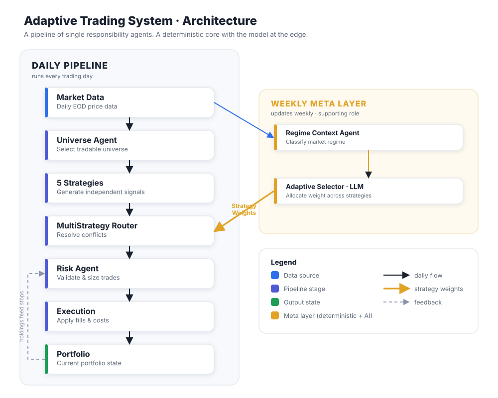

<!-- Part of the "Designing an Adaptive System" series → see ./README.md -->

# Episode 1: Architecture Matters More Than Algorithms

> Diagram asset: `./architecture-diagram.svg` (import into Excalidraw or drop into the post as an image).

## LinkedIn (teaser)

I spent months building an adaptive trading system. Along the way I became convinced
of something that has nothing to do with trading:

**Architecture determines behavior more than algorithms do.**

I started out obsessed with the strategies, the clever part, the part that feels like
the point. But every genuinely surprising thing the finished system did came from the
architecture, not the algorithms. Diversification that quietly vanished. A risk
control I never actually designed. A data step that decided the outcome before any
logic ran.

A few beliefs I ended up with, that I think generalize to any backend system:

→ Constraints belong in code, not in prompts.
→ Determinism is a feature, not an implementation detail.
→ Observability is part of the design, not something you bolt on when it breaks.
→ AI should assist decisions, not enforce invariants.

The full post (with a diagram, and the reasoning behind each) is the first in a new
series. It's about a trading system, but it's really about software architecture. 👇

## Substack (full draft)

**Architecture Matters More Than Algorithms**
*The design behind an adaptive trading system, and what building it taught me about
software architecture.*

This is a post about a trading system, but if you don't care about trading, stay
anyway. The trading is incidental. What I actually want to talk about is what happens
when you build a system out of independent components that have to cooperate,
disagree, and occasionally sabotage each other, because that describes half the
backends any of us have ever worked on.

Here's the belief I came away with, stated plainly so you know where this is going:
**architecture determines behavior more than algorithms do.** I spent most of my
early effort on the strategies, because that's the part that feels clever. Every
surprising thing the system eventually did came from somewhere else.

Here's the whole system on one page:

Read the left column top to bottom and you have the daily pipeline. Market data comes
in. The universe agent narrows the field to what's tradable. Five strategies each
generate their own signals. The router resolves the conflicts between them. The risk
agent validates and sizes whatever survives. Execution applies the fills. The
portfolio updates. On the right, smaller and deliberately secondary, is the weekly
meta layer that decides how much weight each strategy gets.

Now stop looking at the boxes and look at what connects them. The amber *Strategy
Weights* arrow running from the model into the router. The dashed feedback loop from
the portfolio back into risk. Those arrows are what this entire series is really
about: the interesting behavior isn't inside any single box, it's in the connections
between them. Hold that thought.

Four architectural decisions shaped this system. I'll tell you what each one was, and
more usefully why I actually made it, which is rarely the reason I'd have given you at
the time.

**Bet one: a pipeline of single responsibility components.**

The daily flow is a linear pipeline, and each stage owns exactly one concern. What
matters technically is the contract between them: every stage takes a fixed input
shape and emits a fixed output shape. The universe stage emits a set of eligible
symbols. Each strategy emits a list of proposed orders. The router emits at most one
decision per symbol. The risk layer emits orders that are either sized or rejected.
Execution emits fills. Because each handoff has a defined shape, any stage can be unit
tested by feeding it a fixed input and asserting on its output, and any stage can be
replaced without its neighbors noticing.

I'd love to tell you I designed it this way out of architectural principle. The
honest version: I split it into stages because I wanted cleaner code. Smaller files,
clearer ownership, less to hold in my head. The usual reasons.

The real payoff showed up months later and was something I hadn't planned for. When a
result looked wrong, I could ask *which layer* instead of reading the whole system
again. And when I eventually went hunting for the strange behaviors this series is
about, clean boundaries were the only reason they were findable at all, since almost
none of them lived inside a single box.

*The lesson wasn't "separate your concerns." It was that clean boundaries are what
make emergent behavior findable in the first place.*

**Bet two: a deterministic core, with the AI at the edge.**

There's a language model in this system. It runs periodically and makes one judgment
call: how to divide capital across the five strategies given current market
conditions. People assume the model is the brain. It's deliberately the opposite.

It runs on a slower cycle than the pipeline and it never sees raw market data. It is
boxed in from both sides. Ahead of it, deterministic code compresses the whole market
into a single regime label. It computes breadth and volatility features across the
universe, for instance the fraction of names trading above their moving average and
the recent realized volatility, and maps those to a discrete label through fixed
thresholds. The model receives the label, not the raw numbers. Its job is deliberately
narrow: given the regime, return a weight for each strategy as JSON.

Behind it, that JSON is never trusted. The output is parsed, each weight is clamped
into the allowed range for that regime, and the whole vector is renormalized to sum to
one. If the model returns a weight out of bounds, drops a strategy, or hands back
malformed JSON, the code corrects or rejects it before any capital moves. The model
proposes. The code disposes.

This is the belief I hold most strongly out of everything here: **constraints belong
in code, not in prompts.** You can write "this must never exceed X" into a prompt and
the model will *mostly* comply. Mostly is not a word I want anywhere near an
invariant. A prompt is a suggestion. Code is a guarantee. So the model gets to
exercise judgment inside a box whose walls I control.

*The lesson was about trust boundaries: let AI assist the decisions that genuinely
need judgment, and let code enforce the things that must always be true.*

**Bet three: reproducibility, which I had to fight for.**

Early on, I'd make a change, run the whole thing again, and watch the result move,
and I couldn't tell whether *my change* moved it or the system just felt different
that day. That's a miserable way to work. You lose the ability to trust your own
experiments.

Almost everything in the pipeline is naturally deterministic: same input, same
output. The one exception was the language model. Even with sampling temperature set
to zero, hosted models do not promise identical output for identical input. The
provider can change something on their side and your supposedly fixed call quietly
returns something new. One nondeterministic component is enough to poison the
reproducibility of everything downstream of it.

The fix was to put the model behind a cache keyed on a hash of the exact prompt plus
the model name. The first time a prompt runs, the completion is stored; every time
after, the stored completion is returned and the model is never called. For any prompt
I have already seen, the model becomes a pure function of its input. Now when a run's
numbers move, I know it was my change, because the model stream was frozen.

*The lesson wasn't that caching is useful. It was that determinism has to be designed
for. It doesn't happen on its own, and a single rogue component can quietly take it
away from everything downstream.*

**Bet four: observability built in, not bolted on.**

A signal can die at every hop between a strategy proposing it and a fill landing:
filtered out by the universe, outvoted in the router, vetoed by a risk check, starved
of cash. So every drop is recorded with a reason code, not merely counted. The
difference matters. One number saying four hundred signals never executed is noise.
Two hundred out of universe, ninety lost a conflict, eighty over the risk limit,
thirty out of cash is a map of where your system leaks. At the time this felt like housekeeping. It turned
out to be the most valuable code in the project, because it let me audit what the
system actually did instead of what I assumed it did. One of these counters is how I
discovered the thing in the next post, and I'll come back to why it became one of the
most important components in the whole system.

*The lesson: you can't reason your way to the truth about a complex system. You have
to instrument it and let it tell you.*

**What I took from building it.**

Go back to the diagram and look only at the arrows. Every architectural decision
above is really a decision about what happens *between* components: how they hand off, what constrains them, whether
their interaction is reproducible, whether you can see it. When I finally sat down and
wrote an honest diagnostic of the finished system, nearly everything surprising lived
there. Diversification I thought I had, erased by how a few layers interacted. A risk
control I never designed, holding the whole thing up because of execution order. A
data step that decided outcomes before any model logic ran.

None of that lives inside a strategy. It lives in the seams. And you only ever see it
if the architecture is clean enough to trace and you're honest enough to measure
instead of assume.

The rest of this series is about those seams. Next post: how a portfolio of five
strategies collapsed, in practice, into one.
